# Challenge 1 - Coaches Guide

Here is a description of the data

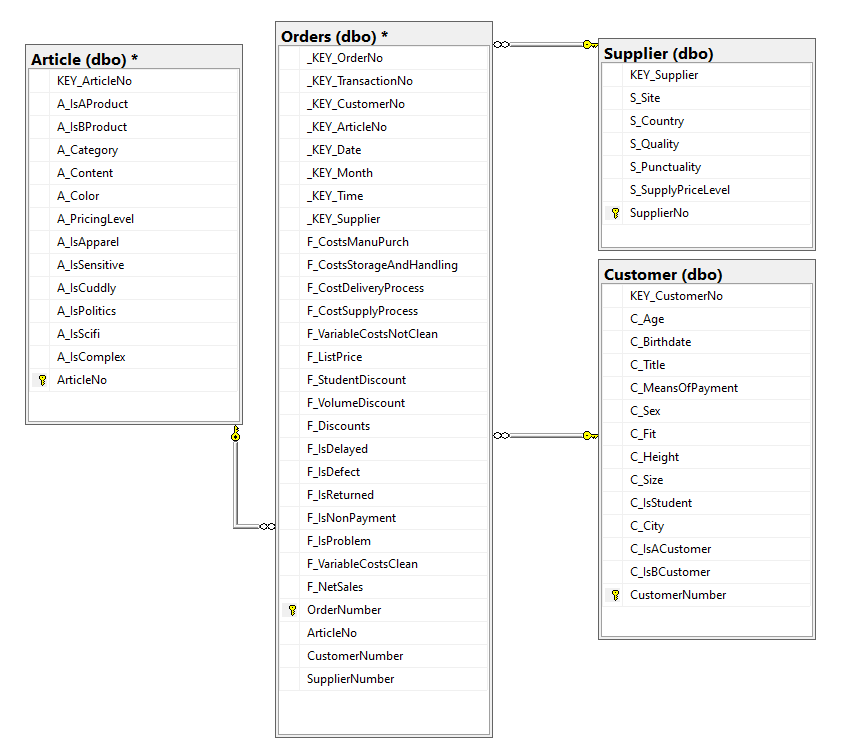

* **Orders table**: Contains the previous orders and if there were any returns, discounts, delays impacting the sale
* **Supplier table**: Contains the location of the Supplier
* **Customer table**: Contains the customer demographic information
* **Article table**: Contains information about

1. Navigate to the Azure portal, open the pre-deployed SQL Server in the **openhack** RG. Copy and paste the Server Name in a notepad, you will need this to connect to the SQL Server Management Studio in the next steps.

   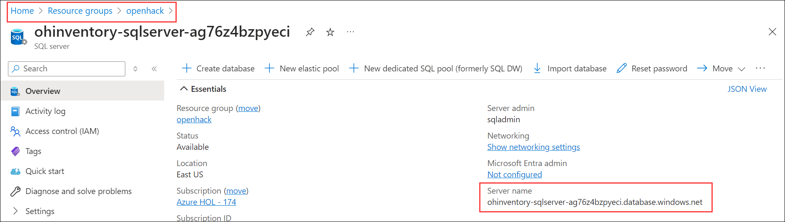

1. In your lab-VM, search for and select **SQL Server Management Studio 20**.

   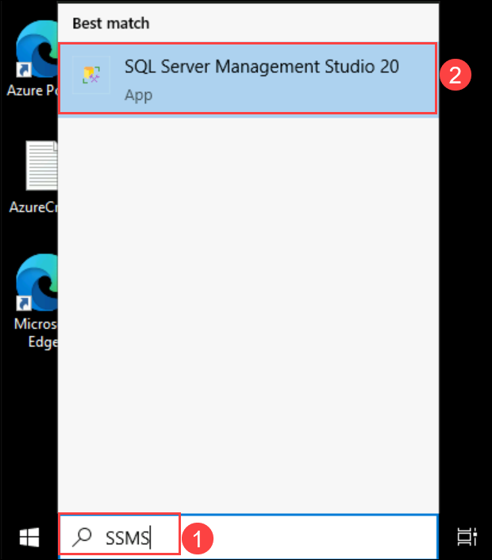

1. Wait for the SSMS to succefully open.

   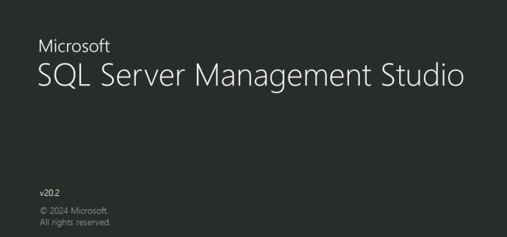

1. Once the SSMS opens, on the **Connect to Server** tab, specify the following details and click on **Connect (6)**.

   - Server type: **Database Engine (1)**
   - Server name: **Select your SQL server (2)**
   - Authentication: **SQL Server Authentication (3)**
   - Login: **sqladmin (4)**
   - Password: **X5FsphLufmY6xHFHaGUR (5)**
  
   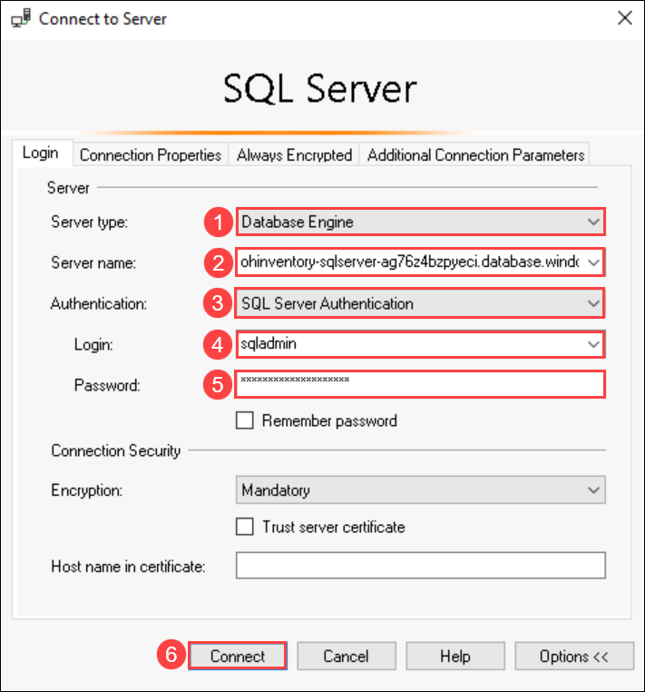

1. Atfer connecting to the SQL Server successfully, right click on **Databases (1)** and select **Import data-tier Application (2)**.

   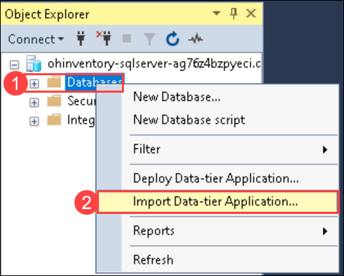

1. On the **Introduction** tab, read through the steps and click on **Next**.

   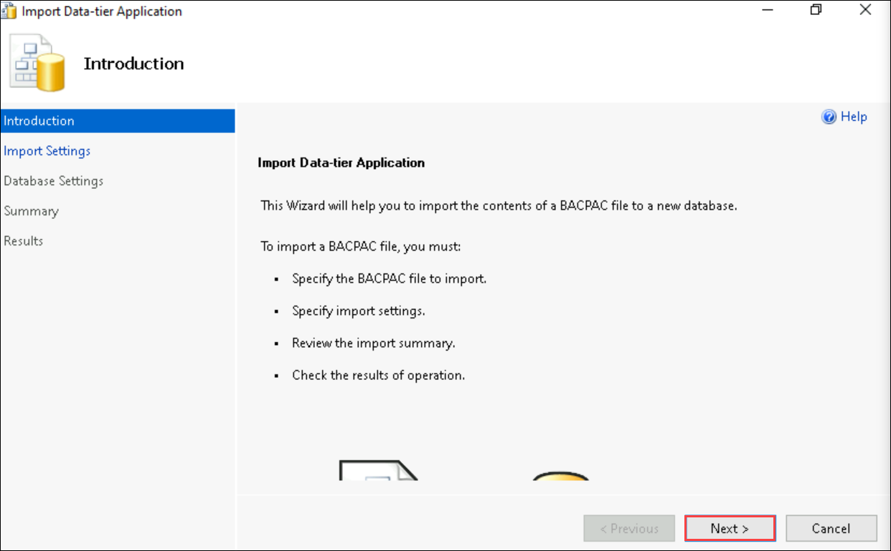

1. On the **Import settings** tab, click on **Browse** and search for and select the **AzureAIHack.bacpac** file and click on **Next**.

   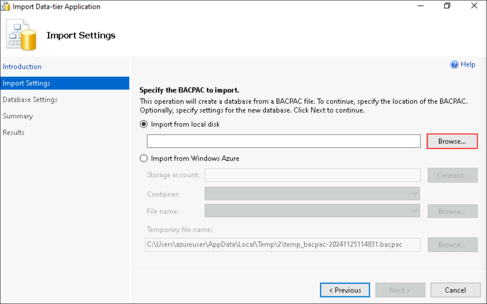

1. On the **Database Settings**, leave the settings as default (make sure you're connected to your SQL Server) and click on **Next**.

   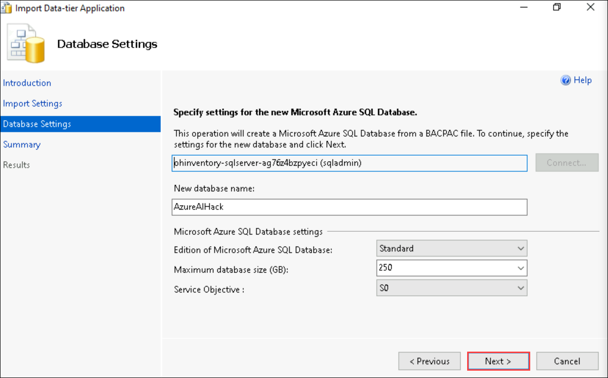

1. On the **Summary** tab, review the settings and click on **Finish**.

   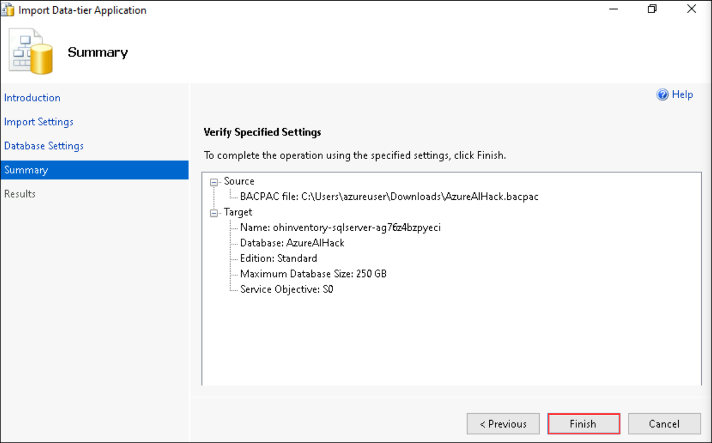

1. Watch the **Progress** and then click on **Close** on the Results tab when the operation completes.

   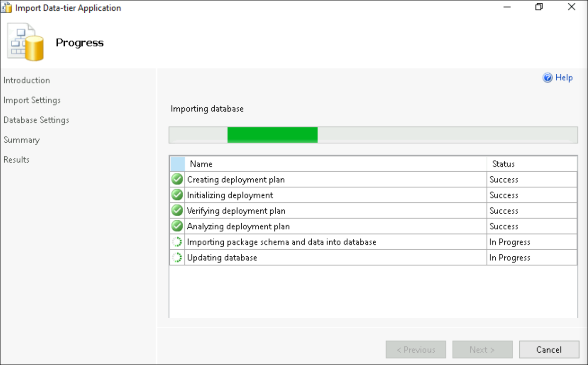

   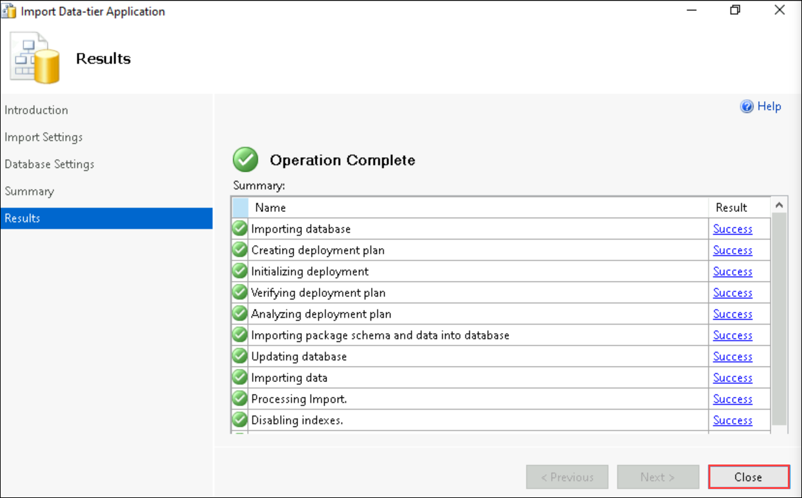

1. Once the operation completes, in the SSMS, expand **Databases > AzureAIHack > Views**, right click on **dbo.MainOrderSample**, navigate to **Script View as > SELECT To > New Query Editor Window**.

   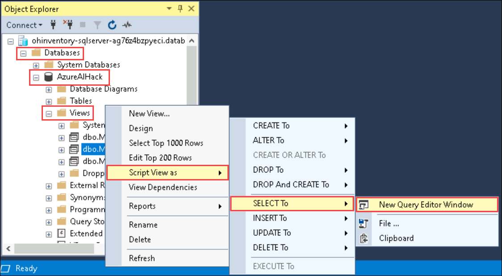

1. On the **New Query Editor Window**, copy the SQL from the **MainOrders** view to look at all 24,815 rows.

    ```
    SELECT        dbo.Orders._KEY_OrderNo, dbo.Orders._KEY_Supplier, dbo.Orders.ArticleNo, dbo.Article.A_Category, dbo.Supplier.S_Country, dbo.Customer.KEY_CustomerNo, dbo.Customer.C_MeansOfPayment, dbo.Customer.C_Fit, 
                             dbo.Orders.F_IsDefect, dbo.Orders.F_IsReturned, dbo.Orders.F_Discounts, dbo.Orders.F_VolumeDiscount, dbo.Orders.F_StudentDiscount, dbo.Orders.F_ListPrice, dbo.Customer.C_City
    FROM            dbo.Article INNER JOIN
                             dbo.Orders ON dbo.Article.ArticleNo = dbo.Orders.ArticleNo INNER JOIN
                             dbo.Customer ON dbo.Orders.CustomerNumber = dbo.Customer.CustomerNumber INNER JOIN
                             dbo.Supplier ON dbo.Orders.SupplierNumber = dbo.Supplier.SupplierNo
    ```


1. Starting from that sample query its possible to modify it to get just the important columns and also the pertinent data with the following query:

    ```
    SELECT   COUNT(dbo.Orders.F_IsReturned),   dbo.Article.A_Category
    FROM            dbo.Article INNER JOIN
                             dbo.Orders ON dbo.Article.ArticleNo = dbo.Orders.ArticleNo INNER JOIN
                             dbo.Customer ON dbo.Orders.CustomerNumber = dbo.Customer.CustomerNumber INNER JOIN
                             dbo.Supplier ON dbo.Orders.SupplierNumber = dbo.Supplier.SupplierNo
    						 WHERE dbo.Orders.F_IsReturned = 1
    						 GROUP BY dbo.Article.A_Category
    						 ORDER BY COUNT(dbo.Orders.F_IsReturned) DESC
    ```

1. This query will provide the following result and shows that the top 2 Categories that have issues are **Accessoires** and **T-Shirtshort** .

   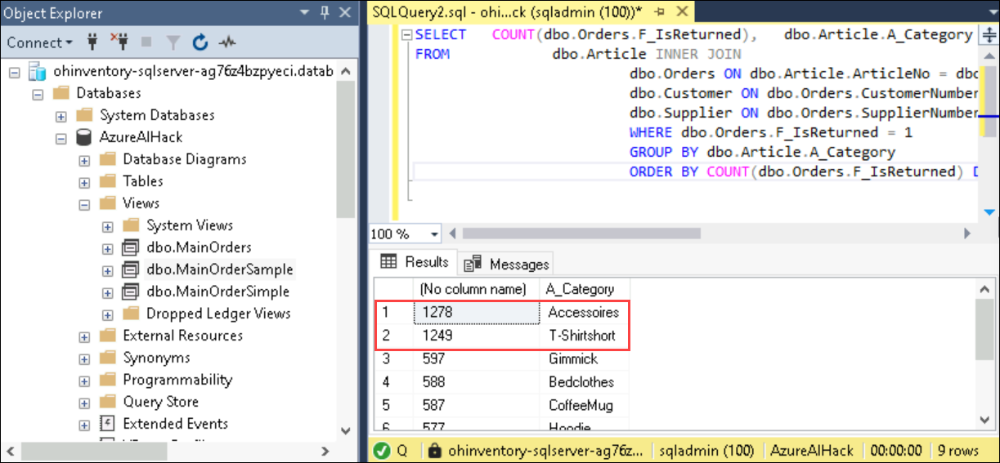
    
