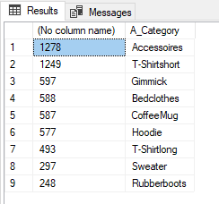

# Challenge 1 - Coaches Guide

Here is a description of the data


* **Orders table**: Contains the previous orders and if there were any returns, discounts, delays impacting the sale
* **Supplier table**: Contains the location of the Supplier
* **Customer table**: Contains the customer demographic information
* **Article table**: Contains information about

1. Visit the Azure portal and get the connection settings for the pre-built Azure SQL Database

1. Open the Database in SQL Server, after setting the firewall rule

1. Copy the SQL from the **MainOrders** view to look at all 24,815 rows

    ```
    SELECT        dbo.Orders._KEY_OrderNo, dbo.Orders._KEY_Supplier, dbo.Orders.ArticleNo, dbo.Article.A_Category, dbo.Supplier.S_Country, dbo.Customer.KEY_CustomerNo, dbo.Customer.C_MeansOfPayment, dbo.Customer.C_Fit, 
                             dbo.Orders.F_IsDefect, dbo.Orders.F_IsReturned, dbo.Orders.F_Discounts, dbo.Orders.F_VolumeDiscount, dbo.Orders.F_StudentDiscount, dbo.Orders.F_ListPrice, dbo.Customer.C_City
    FROM            dbo.Article INNER JOIN
                             dbo.Orders ON dbo.Article.ArticleNo = dbo.Orders.ArticleNo INNER JOIN
                             dbo.Customer ON dbo.Orders.CustomerNumber = dbo.Customer.CustomerNumber INNER JOIN
                             dbo.Supplier ON dbo.Orders.SupplierNumber = dbo.Supplier.SupplierNo
    ```


1. Starting from that sample query its possible to modify it to get just the important columns and also the pertinent data with the following query:

    ```
    SELECT   COUNT(dbo.Orders.F_IsReturned),   dbo.Article.A_Category
    FROM            dbo.Article INNER JOIN
                             dbo.Orders ON dbo.Article.ArticleNo = dbo.Orders.ArticleNo INNER JOIN
                             dbo.Customer ON dbo.Orders.CustomerNumber = dbo.Customer.CustomerNumber INNER JOIN
                             dbo.Supplier ON dbo.Orders.SupplierNumber = dbo.Supplier.SupplierNo
    						 WHERE dbo.Orders.F_IsReturned = 1
    						 GROUP BY dbo.Article.A_Category
    						 ORDER BY COUNT(dbo.Orders.F_IsReturned) DESC

1. This query will provide the following result and shows that the top 2 Categories that have issues are **Accessoires** and **T-Shirtshort** .

    
    
