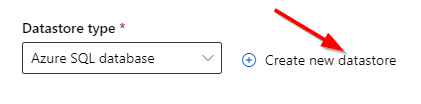
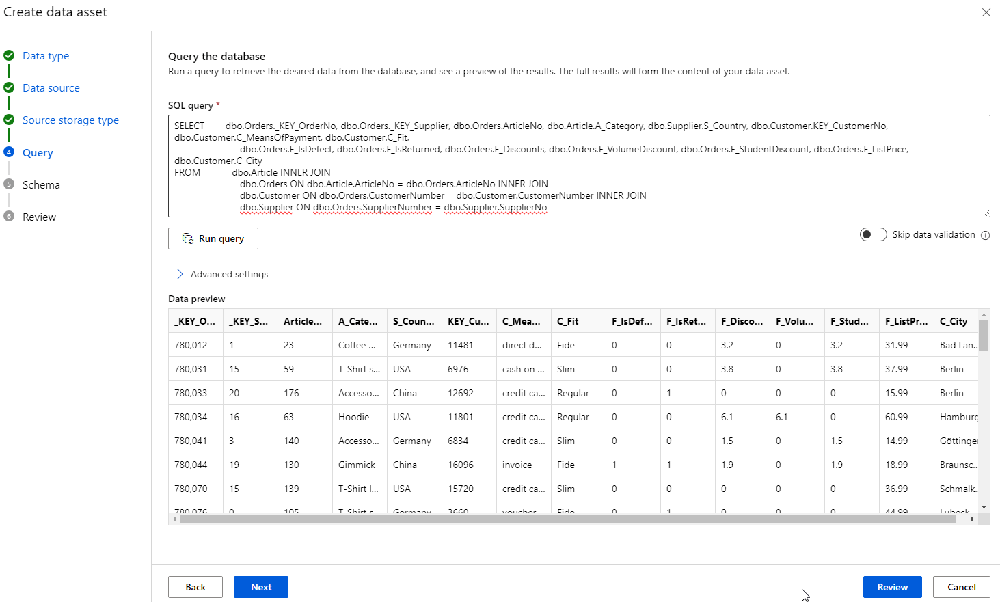
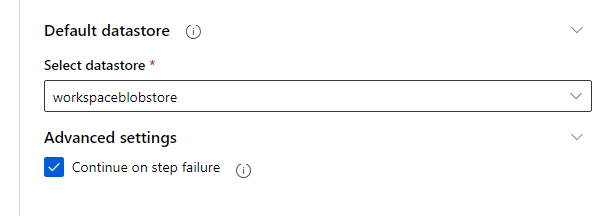
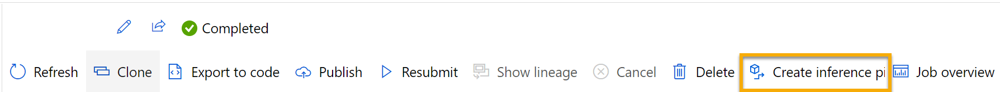
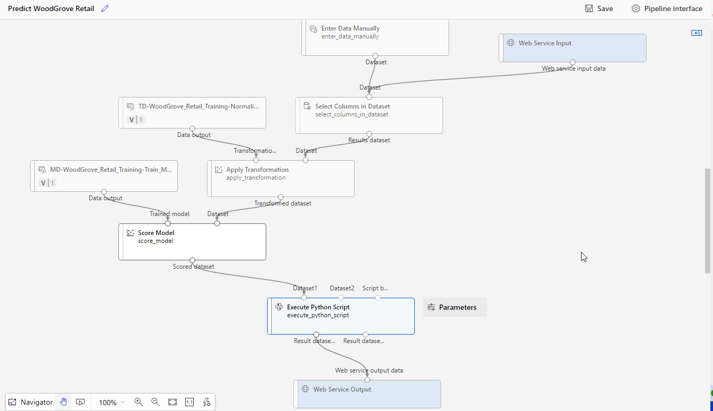
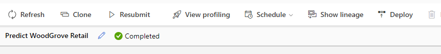
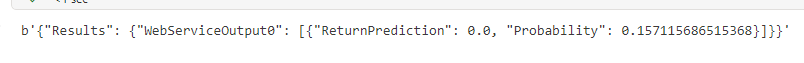

# Challenge 2 - Coaches Guide

## Machine Learning 

### Create an Azure Machine Learning workspace

1. Sign into the Azure portal using your Microsoft credentials.
1. Select + Create a resource, search for Machine Learning, and create a new Azure Machine Learning resource with an Azure Machine Learning plan. Use the following settings:
    * **Subscription**: Your Azure subscription.
    * **Resource group**: Create or select a resource group.
    * **Workspace name**: Enter a unique name for your workspace.
    * **Region**: Select the closest geographical region.
    * **Storage account**: Note the default new storage account that will be created for your workspace.
    * **Key vault**: Note the default new key vault that will be created for your workspace.
    * **Application insights**: Note the default new application insights resource that will be created for your workspace.
    * **Container registry**: None (one will be created automatically the first time you deploy a model to a container)
1. Select Review + create, then select Create. Wait for your workspace to be created (it can take a few minutes), and then go to the deployed resource.
1. Select Launch studio (or open a new browser tab and navigate to https://ml.azure.com, and sign into Azure Machine Learning studio using your Microsoft account).

### Create compute
1. In Azure Machine Learning studio, select the ≡ icon (a menu icon that looks like a stack of three lines) at the top left to view the various pages in the interface (you may need to maximize the size of your screen). You can use these pages in the left hand pane to manage the resources in your workspace. Select the Compute page (under Manage).

1. On the Compute page, select the Compute clusters tab, and add a new compute cluster with the following settings. You’ll use this to train a machine learning model:

    * **Location**: Select the same as your workspace. If that location is not listed, choose the one closest to you.
    * **Virtual machine tier**: Dedicated
    * **Virtual machine type**: CPU
    * **Virtual machine size**:
        * Choose Select from all options
        * Search for and select **Standard_DS11_v2**
    * Select **Next**
    * **Compute name**: enter a unique name.
    * **Minimum number of nodes**: 0
    * **Maximum number of nodes**: 2
    * **Idle seconds before scale down**: 120
    * **Enable SSH access**: Clear
    * Select **Create**

### Create a dataset
1. In Azure Machine Learning studio, expand the left pane by selecting the menu icon at the top left of the screen. Select the Data page (under Assets). The Data page contains specific data files or tables that you plan to work with in Azure ML. You can create datasets from this page as well.

1. On the Data page, under the Data assets tab, select + Create. Then configure a data asset with the following settings:

    * **Name:** Provide a unique name
    * **Description:** Store the SQL Data
    * **Type:** Tabular
    
1. Click **Next**
1. Click on the **From SQL databases** option and click **Next**
1. Click on the **Create new datastore** link

    


    * **Datastore name**: inventoryissues
    * **Datastore type**: Azure SQL Database
    * **Account selection method**:: From Azure Subscription
    * Select your Subscription and Servername from dropdowns
    * **Authentication type**: SQL Authentication
    * **User ID**: sqladmin
    * **Password**: X5FsphLufmY6xHFHaGUR


1. Click **Create** and use **inventoryissues** as the name.
    
    
    
1. Select the newly created Datastore

    

1. Click on **Next**
1. Can use this as a sample query or come up with their own. This is based on the provided View in SQL Server

    ```
    SELECT        dbo.Orders._KEY_OrderNo, dbo.Orders._KEY_Supplier, dbo.Orders.ArticleNo, dbo.Article.A_Category, dbo.Supplier.S_Country, dbo.Customer.KEY_CustomerNo, dbo.Customer.C_MeansOfPayment, dbo.Customer.C_Fit, 
                             dbo.Orders.F_IsDefect, dbo.Orders.F_IsReturned, dbo.Orders.F_Discounts, dbo.Orders.F_VolumeDiscount, dbo.Orders.F_StudentDiscount, dbo.Orders.F_ListPrice, dbo.Customer.C_City
    FROM            dbo.Article INNER JOIN
                             dbo.Orders ON dbo.Article.ArticleNo = dbo.Orders.ArticleNo INNER JOIN
                             dbo.Customer ON dbo.Orders.CustomerNumber = dbo.Customer.CustomerNumber INNER JOIN
                             dbo.Supplier ON dbo.Orders.SupplierNumber = dbo.Supplier.SupplierNo
    ```

1. Click **Run query**
1. Click on **Next**

    

1. In the Schema section change the following fields detected as **Decimal** to **Integer**
    * **F_IsDefect**
    * **F_IsReturned**
    * **F_VolumeDiscount**

    
1. Click on **Next**
1. Click on **Create**

### Create a pipeline in Designer and load data to canvas

To get started with Azure Machine Learning designer, first you must create a pipeline and add the dataset you want to work with.

1. In Azure Machine Learning studio, on the left pane select the Designer item (under Authoring), and then select + to create a new pipeline.

1. Make sure the **Classic prebuilt** tab is selected then click the **Create a new pipeline using classic prebuilt components**.

    

1. Change the draft name from Pipeline-Created-on-date to **WoodGrove Retail Training**.

1. Then in the project, next to the pipeline name on the left, select the arrows icon to expand the panel if it is not already expanded. The panel should open by default to the Asset library pane, indicated by the books icon at the top of the panel. Note that there is a search bar to locate assets. Notice two buttons, Data and Component.

    
    
1. Select Data. Search for and place the **inventoryissues** dataset onto the canvas.

1. Right-click (Ctrl+click on a Mac) the named dataset on the canvas, and select Preview data.

1. Review the schema of the data in the Profile tab, noting that you can see the distributions of the various columns as histograms.

1. Close the DataOutput tab so that you can see the dataset on the canvas like this:
    
    
    
### Add transformations

1. In the Asset library pane on the left, select Component, which contains a wide range of modules you can use for data transformation and model training. You can also use the search bar to quickly locate modules.

    
    
1. Find the **Select Columns in Dataset** module and place it on the canvas below the inventoryissues dataset. Then connect the output from the bottom of the inventoryissues dataset to the input at the top of the Select Columns in Dataset module.

1. Double click on the Select Columns in Dataset module to access a settings pane on the right. Select Edit column. Then in the Select columns window, select **By name** and **Add all** the columns. 

1. Find the **Normalize Data** module and place it on the canvas below the Select Columns in Dataset module. Then connect the output from the bottom of the Select Columns in Dataset module to the input at the top of the Normalize Data module, like this:

    

1. Double-click the Normalize Data module to view its settings, noting that it requires you to specify the transformation method and the columns to be transformed.

1. Set the Transformation method to MinMax and the Use 0 for constant columns when checked to True. Edit the columns to transform with Edit columns. Select columns With Rules and copy and paste the following list under include column names:

    ```
    _KEY_OrderNo, _KEY_Supplier, ArticleNo, KEY_CustomerNo, F_Discounts, F_VolumeDiscount, F_StudentDiscount, F_ListPrice,F_IsReturned
    ```
    
    
    
1. Click Save and close the selection box.

The data transformation is normalizing the numeric columns to put them on the same scale, which should help prevent columns with large values from dominating model training. 

### Run the pipeline
To apply your data transformations, you need to run the pipeline as an experiment.

1. Select Configure & Submit at the top of the page to open the Set up pipeline job dialogue.

1. On the Basics page select Create new and set the name of the experiment to **woodgrove-training** then select Next .

1. On the Inputs & outputs page select Next without making any changes.

1. On the Runtime settings page an error appears as you don´t have a default compute to run the pipeline. In the Select compute type drop-down select Compute cluster and in the Select Azure ML compute cluster drop-down select your recently created compute cluster. Leave the default value in the **Select datastore** of **workplaceblobstore**

    

1. Select **Review + Submit** to review the pipeline job and then select **Submit** to run the training pipeline.

1. Wait a few minutes for the run to finish. You can check the status of the job by selecting Jobs under the Assets. From there, select the woodgrove-training experiment and then the WoodGrove Retail Training job.

### View the transformed data
When the run has completed, the dataset is now prepared for model training.

1. Right-click (Ctrl+click on a Mac) the Normalize Data module on the canvas, and select Preview data. Select Transformed dataset.

1. View the data, noting that the numeric columns you selected have been normalized to a common scale.

1. Close the normalized data result visualization. Return to the previous tab.

After you’ve used data transformations to prepare the data, you can use it to train a machine learning model.

### Add training modules
It’s common practice to train the model using a subset of the data, while holding back some data with which to test the trained model. This enables you to compare the labels that the model predicts with the actual known labels in the original dataset.

1. Return to the Designer page and select the **Woodgrove Retail Training** pipeline. Below is a preview of the updates to make after the **Normalize Data** component

    

1. In the **Asset library** pane on the left, in **Component**, search for and place a **Split Data** module onto the canvas under the **Normalize Data module**. Then connect the **Transformed Dataset (left)** output of the **Normalize Data module** to the input of the **Split Data module**.

> Tip Use the search bar to quickly locate modules.

1. Double-click the **Split Data** module, and configure its settings as follows:
    * **Splitting mode**: Split Rows
    * **Fraction of rows in the first output dataset**: 0.7
    * **Randomized split**: True
    * **Random seed**: 123
    * **Stratified split**: False

1. In the **Asset library**, search for and place a **Train Model** module to the canvas, under the **Split Data** module. Then connect the **Results dataset1** (left) output of the **Split Data** module to the **Dataset** (right) input of the **Train Model** module.

1. The model we’re training will predict the **F_IsReturned** value, so select the **Train Model** module and modify its settings to set the Label column to F_IsReturned.

The **F_IsReturned** the model will predict is a class (0 or 1), so we need to train the model using a classification algorithm. Specifically, there are two possible classes, so we need a binary classification algorithm.

1. In the Asset library, search for and place a **Two-Class Logistic Regression** module to the canvas, to the left of the **Split Data** module and above the **Train Model** module. Then connect its output to the **Untrained** model (left) input of the **Train Model** module.

1. To test the trained model, we need to use it to score the validation dataset we held back when we split the original data - in other words, predict labels for the features in the validation dataset.

1. In the Asset library, search for and place a **Score Model** module to the canvas, below the Train Model module. Then connect the output of the Train Model module to the Trained model (left) input of the **Score Model** module; and connect the Results dataset2 (right) output of the Split Data module to the Dataset (right) input of the **Score Model** module.

### Run the training pipeline
Now you’re ready to run the training pipeline and train the model.

1. Select Configure & Submit, and run the pipeline using the existing experiment named woodgrove-training.

1. Wait for the experiment run to finish. This may take 5 minutes or more.

1. Check the status of the job by selecting **Jobs** under the **Assets**. From there, select the **woodgrove-training** experiment and then select the latest **WoodGrove Retail Training** job.

1. On the new tab, right-click (Ctrl+click on a Mac) the **Score Model** module on the canvas, select **Preview data** and then select **Scored dataset** to view the results.

1. Scroll to the right, and note that next to the **F_IsReturned** column (which contains the known true values of the label) there is a new column named **Scored Labels**, which contains the predicted label values, and a **Scored Probabilities** column containing a probability value between 0 and 1. This indicates the probability of a positive prediction, so probabilities greater than 0.5 result in a predicted label of 1 (returned), while probabilities between 0 and 0.5 result in a predicted label of 0 (not returned).

    

1. Close the Scored_dataset tab.

### Add an Evaluate Model module

1. Return to **Designer** and open the **WoodGrove Retail Training** pipeline you created.

1. In the **Asset library**, search for and place an **Evaluate Model** module to the canvas, under the **Score Model** module, and connect the output of the **Score Model** module to the **Scored dataset** (left) input of the **Evaluate Model** module.

1. Ensure your pipeline looks like this: 

    
    
1.Click **Save**

1. Select **Configure & Submit**, and run the pipeline using the existing experiment named woodgrove-training.

1. Wait for the experiment run to finish.

1. Check the status of the job by selecting Jobs under the Assets. From there, select the woodgrove-training experiment and then select the latest **WoodGrove Retail Training** job.

1. On the new tab, right-click (Ctrl+click on a Mac) the **Evaluate Model** module on the canvas, select **Preview data** then select **Evaluation results** to view the performance metrics. These metrics can help data scientists assess how well the model predicts based on the validation data.

1. Scroll down to view the **confusion matrix** for the model. Observe the predicted and actual value counts for each possible class.

1. Review the metrics to the left of the confusion matrix, which include:
    * **Accuracy**: In other words, what proportion of **F_IsReturn** predictions did the model get right?
    * **Precision**: In other words, out of all the orders that the model predicted as having returns, the percentage of time the model is correct.
    * **Recall**: In other words, out of all the orders who actually have returns, how many returns cases did the model identify correctly?
    * **F1 Score**

1. Use the **Threshold** slider located above the list of metrics. Try moving the threshold slider and observe the effect on the confusion matrix. If you move it all the way to the left (0), the Recall metric becomes 1, and if you move it all the way to the right (1), the Recall metric becomes 0.

1. Look above the Threshold slider at the **ROC curve** and **AUC metric** listed with the other metrics below. To get an idea of how this area represents the performance of the model, imagine a straight diagonal line from the bottom left to the top right of the **ROC chart**. This represents the expected performance if you just guessed or flipped a coin for each order - you could expect to get around half of them right, and half of them wrong, so the area under the diagonal line represents an AUC of 0.5. If the AUC for your model is higher than this for a binary classification model, then the model performs better than a random guess.

1. Close the **Evaluation_results** tab.

### Create an inference pipeline

1. Locate the menu above the canvas and select **Create inference pipeline**. You may need to expand your screen to full and click on the three dots icon … on the top right hand corner of the screen in order to find **Create inference pipeline** in the menu.

    
    
1. In the **Create inference pipeline** drop-down list, select **Real-time inference pipeline**. After a few seconds, a new version of your pipeline named **WoodGrove Retail Training-real time inference** will be opened.

1. Rename the new pipeline to **Predict WoodGrove Retail**, and then review the new pipeline. Some of the transformations and training steps are a part of this pipeline. The trained model will be used to score the new data. The pipeline also contains a web service output to return results.
    * Add a **web service input** component for new data to be submitted.
    * Replace the **inventoryissues** dataset with an **Enter Data Manually** module 
    * Remove the **Evaluate Model** module.
    * Insert an **Execute Python Script** module before the web service output to return only the <mark>patient ID, predicted label value, and probability</mark>.
1. The pipeline does not automatically include a **Web Service Input** component for models created from custom data sets. Search for a **Web Service Input** component from the asset library and place it at the top of the pipeline. Connect the output of the **Web Service Input** component to the **Select Columns in Dataset** component that is already on the canvas.

1. The inference pipeline assumes that new data will match the schema of the original training data, so the inventoryissues dataset from the training pipeline is included. However, this input data includes the **F_IsReturn** label that the model predicts, which is not included in new order data for which a return prediction hasn’t yet been made. Delete this module and replace it with an **Enter Data Manually** module, containing the following CSV data, which includes feature values without labels for three new order observations:

    ```
    _KEY_OrderNo, _KEY_Supplier, ArticleNo, KEY_CustomerNo, F_Discounts, F_VolumeDiscount, F_StudentDiscount, F_ListPrice,F_IsReturned,A_Category,S_Country,C_MeansOfPayment,C_Fit,F_IsDefect,C_City
    1028476,16,502,10752,0,0,0,33.99,0,T-Shirt short,USA,direct debit,Regular,0,Berlin
    1028477,16,155,9063,3.3,0,3.3,32.99,0,T-Shirt long,USA,voucher,Regular,0,Berlin
    1028478,1,31,9063,4.1,0,4.1,40.99,0,T-Shirt long,Germany,voucher,Regular,0,Berlin
    ```

1. Connect the new **Enter Data Manually** module to the same Dataset input of the Select Columns in Dataset module as the Web Service Input.

1. Edit the **Select Columns in Dataset** module. Update to the following:

    ```
    _KEY_OrderNo, _KEY_Supplier, ArticleNo, KEY_CustomerNo, F_Discounts, F_VolumeDiscount, F_StudentDiscount, F_ListPrice,F_IsReturned,A_Category,S_Country,C_MeansOfPayment,C_Fit,F_IsDefect,C_City
    ```

1. The inference pipeline includes the **Evaluate Model** module, which isn’t useful when predicting from new data, so delete this module.

1. The output from the **Score Model** module includes all of the input features and the predicted label and probability score. To limit the output to only the prediction and probability:
    * Delete the connection between the Score Model module and the Web Service Output.
    * Add an **Execute Python Script** module, replacing all of the default python script with the following code. Be cautious about tabs and spaces. If setup incorrectly the code will fail and cause delays in running the pipeline.:
    
    > Note: Dont forget about tabs and spaces in Python. This module will throw an error if it is incorrect.
    
    
    
    ```
    import pandas as pd


    def azureml_main(dataframe1=None, dataframe2=None):
    
        scored_results = dataframe1[["Scored Labels", "Scored Probabilities"]]
        scored_results.rename(
            columns={
                "Scored Labels": "ReturnPrediction",
                "Scored Probabilities": "Probability",
            },
            inplace=True,
        )
        return scored_results
     ```

1. Connect the output from the **Score Model** module to the **Dataset1** (left-most) input of the **Execute Python Script**, and connect the Result dataset (left) output of the **Execute Python Script** module to the **Web Service Output**.

1. Verify that your pipeline looks similar to the following image:

    
    
1. Click **Save**

1. Click **Configure & Submit**
    
1. Run the pipeline as a new experiment named **woodgrove-retail-inference** on your compute cluster. The experiment may take a while to run.

1. Return to the Jobs tab. From there, select the **woodgrove-retail-inference** experiment and then select the **Predict WoodGrove Retail** job.

1. When the pipeline has completed, select the **Execute Python Script** module. Select the **Preview data** and select **Result dataset** to see the predicted labels and probabilities for the three order observations in the input data.

### Deploy a service
1. At the top of the Predict WoodGrove Retail job window, select Deploy.
    
    
    
1. In the Set up real-time endpoint select Deploy new real-time endpoint and use the following settings:
    * **Name**: predict-returns
    * **Description**: Classify returns
    * **Compute type**: Azure Container Instance

1. Select Deploy and wait for the web service to be deployed - this can take several minutes.

### Test the service
    > The deployment will take a long time. Wait until in the **Deployment state** is **Healthy**
    


1. On the Endpoints page, open the **predict-returns** real-time endpoint.
1. Click on the **Consume** tab
1. Copy the Python code provided.
1. Click **Notebooks** under **Authoring** and open in a new tab
1. Next to your username file explorer click on the three dots and select **Create a new file**
1. Leave the default values
1. Copy the Python code in the Notebook
1. Return to the previous tab and view/copy the **Primary key** and paste in the python code where it displays 

    ```
    api_key=''
    ```

1.In the Compute section create a new Compute instance selecting the **Standard_D11_v2** instance.
1. Wait for the compute to spin up (10 15 minutes)
1. Paste in the following sample json in the data section of the python code. 

    > Note this is just testing that it is functional
    ```
    {
    	"Inputs": {
    		"input1": [
    			{
    				"_KEY_OrderNo": 1028476,
    				"_KEY_Supplier": 16,
    				"ArticleNo": 502,
    				"KEY_CustomerNo": 10752,
    				"F_Discounts": 0,
    				"F_VolumeDiscount": 0,
    				"F_StudentDiscount": 0,
    				"F_ListPrice": 33.99,
    				"F_IsReturned": 0,
    				"A_Category": "T-Shirt short",
    				"S_Country": "USA",
    				"C_MeansOfPayment": "direct debit",
    				"C_Fit": "Regular",
    				"F_IsDefect": 0,
    				"C_City": "Berlin"
    			}
    		]
    	},
    	"GlobalParameters": {}
    }
    ```
1. Execute the cell
1. View the results at the bottom

    
    
1. This sample json will provide a positive detection of a return

    ```
    {
    	"Inputs": {
    		"input1": [
    			{
    				"_KEY_OrderNo": 477063,
    				"_KEY_Supplier": 35,
    				"ArticleNo": 568702,
    				"KEY_CustomerNo": 805629,
    				"F_Discounts": 1,
    				"F_VolumeDiscount": 1,
    				"F_StudentDiscount": 1,
    				"F_ListPrice": 1886.79,
    				"F_IsReturned": 0,
    				"A_Category": "Accessoires",
    				"S_Country": "France",
    				"C_MeansOfPayment": "voucher",
    				"C_Fit": "Fide",
    				"F_IsDefect": 1,
    				"C_City": "Regensburg"
    			}
    		]
    	},
    	"GlobalParameters": {}
    }
    ```
