# Challenge 3 - Coaches Guide

## Image Search

### Create a new custom model

1. Create a Custom Vision model.

   
   
 In the Basics tab, provide the necessary details.
    
 - Create Options : Both
 - Resources Group : OpenHack
 - Region : East US
 - Name : Give the unique name
 - Traning pricing tier : Standard S0
 - Prediction pricing tier : standard S0
    
 Keeping all other tabs default. Click on "Review + Create" to finalize and create it.

   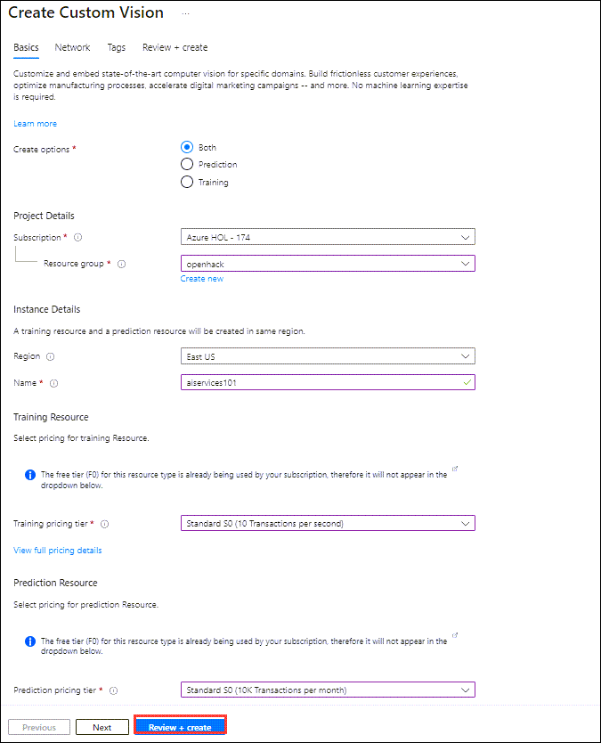
   
1. Login to the vision portal Begin by going to Vision Studio , selecting the Image analysis tab. Then select the Customize models tile.
    
    ```
    https://portal.vision.cognitive.azure.com/
    ```
1. Sign in using the text in the upper right-hand corner

1. Click the **View all resources** .

   

1. Click on Create a new resource .

   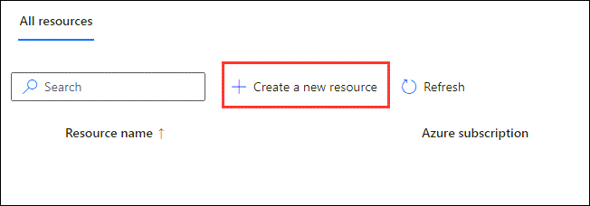

1. Click on the **Create a new reseource** link to get a popup. Give it some time to create the resource .
        
    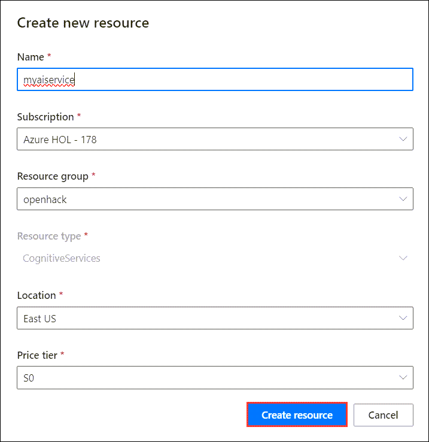
    
1. In the breadcrumbs click on the **Vision Studio** text

    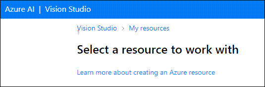
    
1. Click on the **Image analysis** tab and then select **Customize models with images**

    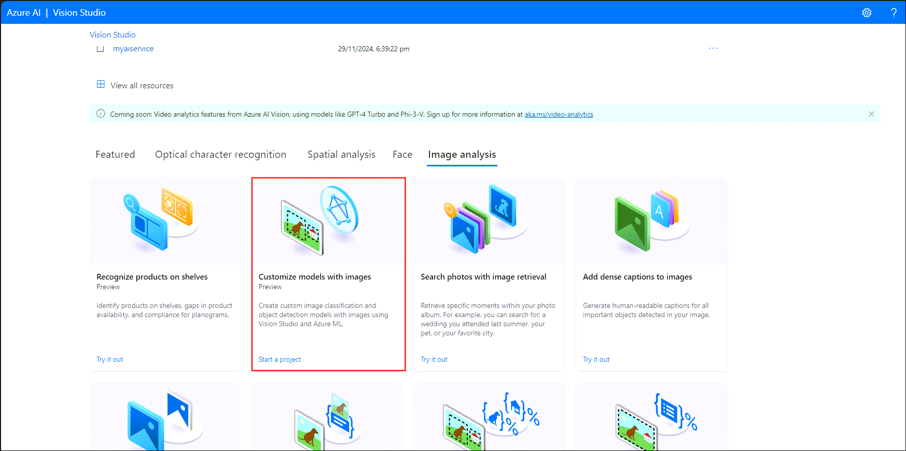
    
1. You will be redirected to select your resource again. Now just click on the **Resource name** you created

    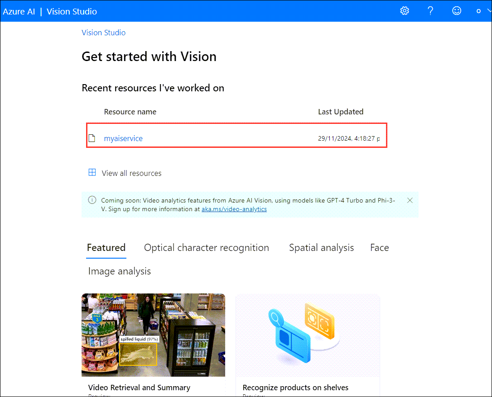
    
### Add a dataset
> Note: To complete the next series of steps you need to have a **Azure Storage Service** created that has **Anonymous access** enabled. Additionally, you need a **Container** called **Images** that is also set to **Anonymous for Containers** 

1. Upload the extract and upload the images into the newly created container.

1. Click onn **Add new dataset**

    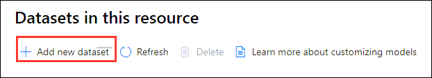
    
1. Provide a unique **datasetname** and set the model to **Object detection** and also Select a container to use by clicking on the link. Then finally fill in the checkbox to **Allow Visual Studio to read and write to you blob storage**, Then click the **Create dataset** button.

    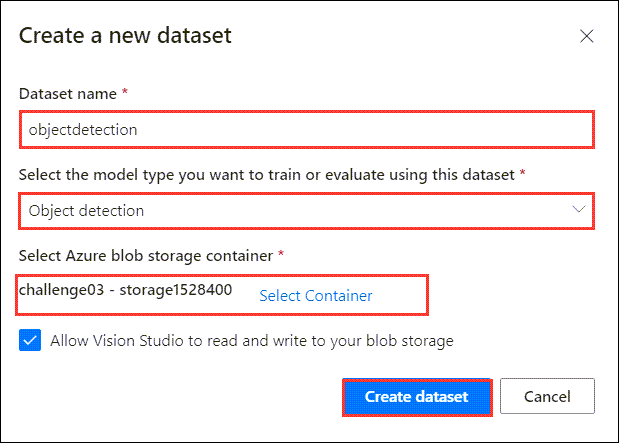  

1. Click on the **Create AzumreML Data Labeling Project**

    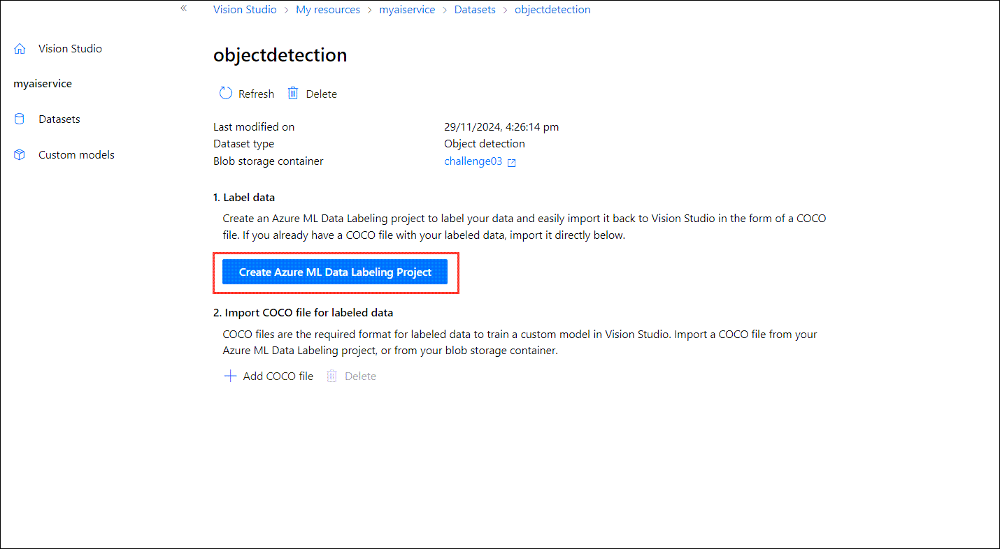

1. In the popup provide a unique **Project name** and the click the **Create a new workspace** link

    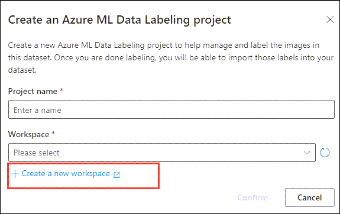
    
1. Fill out the details and then **Review + create**

    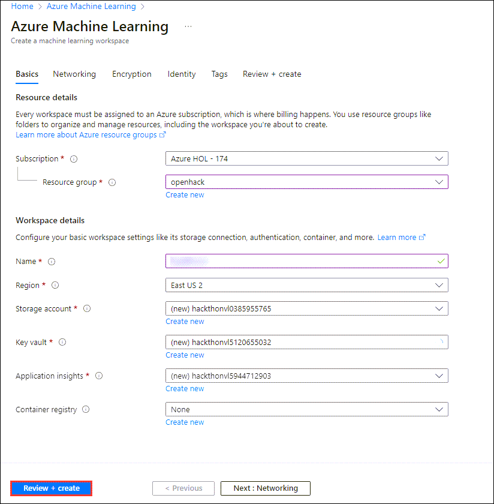
    
1. Once you see **Your deployment is complete** then return to the previous tab
    
1. Click the refresh icon and select your newly created workspace from the dropdown

    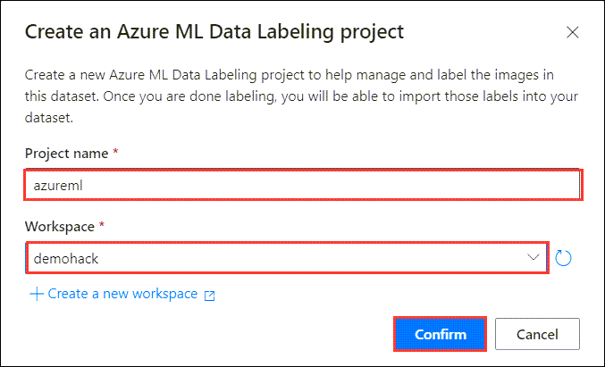
    
1. Give it a moment to create

    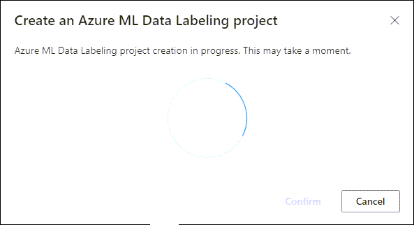
    
1. The button will update and now click on the new button **Go to Azure ML Labeling Project - xxxxxx"

    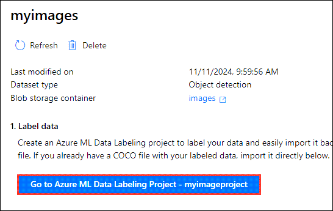
    
1. In **Azure Machine Learning Studio** click on the **Add label categorie** text

    
    
1. Click on the **Add label category** text

    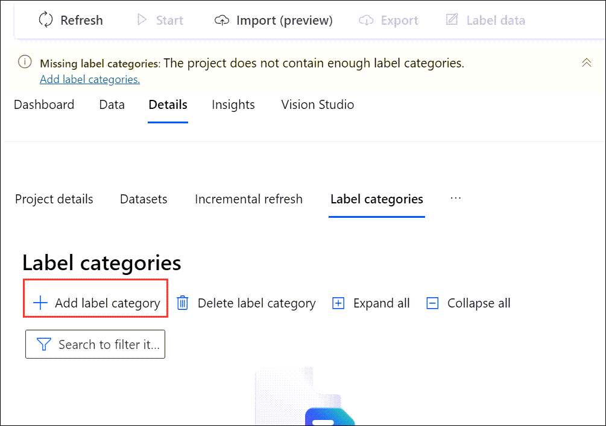
    
1. In the dialog enter the first **Category label** and keep clicking the **Add label category** text till complete

    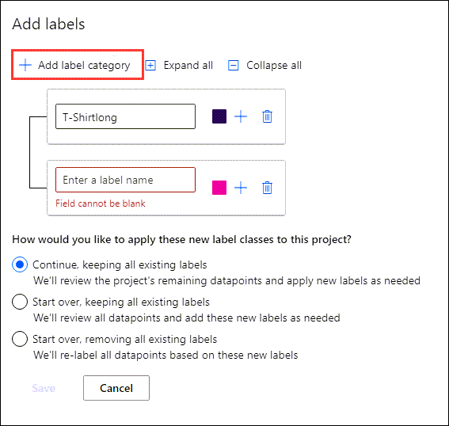
    
1. Category Labels needed:
    * T-Shirtlong
    * T-Shirtshort
    * Gimmick
    * Sweater
    * Bedclothes
    * Accessoires
    * CoffeeMug
    * Hoodie
    * Rubberboots

1. Once all the **Labels** are added click on **Save**

    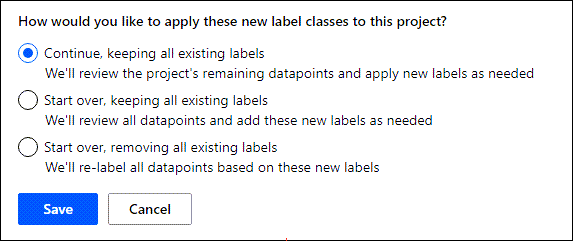
    
1. Then click on the **Start** button. This will activate the **Label data** button. Click on **Label data** when it is available.

    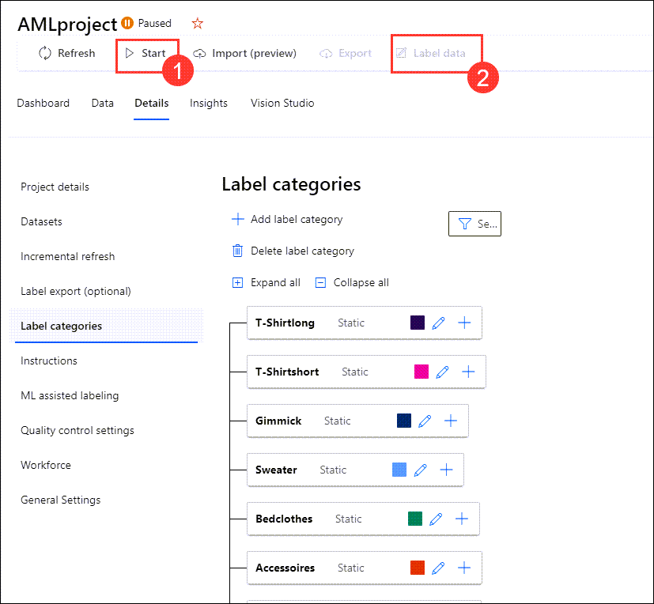
    
1. To use the Labeling functionality this is a quick overview
    A. Use this to select the region you want to use in the image. For these images select all of the image
    B. Set the tag that matches the image. If you are not sure which one goes you can go back to the Images previously downloaded
    C. As you set each Label you can click on the **Next** button to set the attributes for the next image.
    D. If you make a mistake you can click on the **Previous** link
    E. To see how many images are left to apply a tag to you can view in the upper right hand corner
    F. When complete with each image click the **Submit** button.
    
   >Note : Please repeat the same steps for all 28 images.

    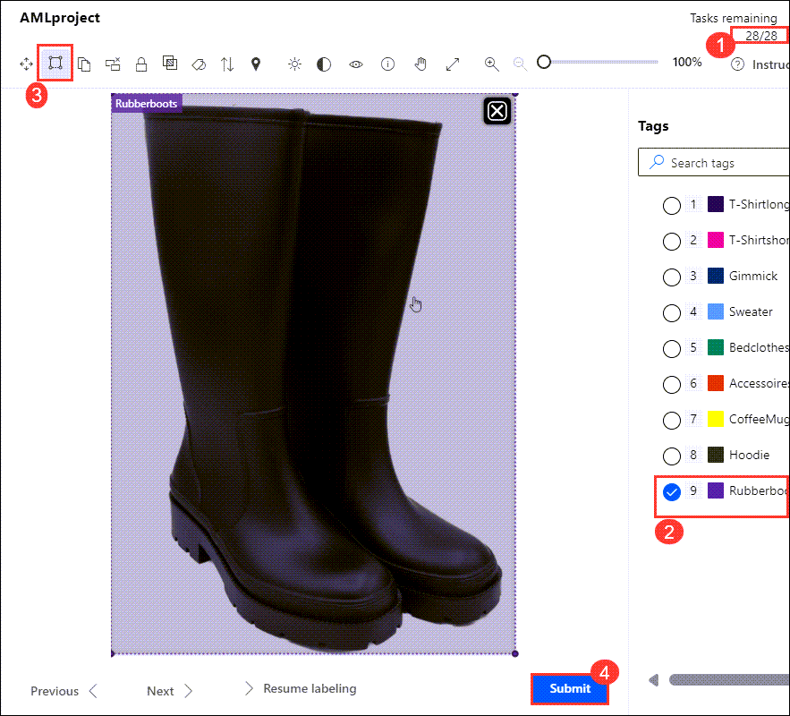
    
1. When you're finished, return to the Vision Studio tab in your browser.

1. Click on the **+ Add COCO file**

    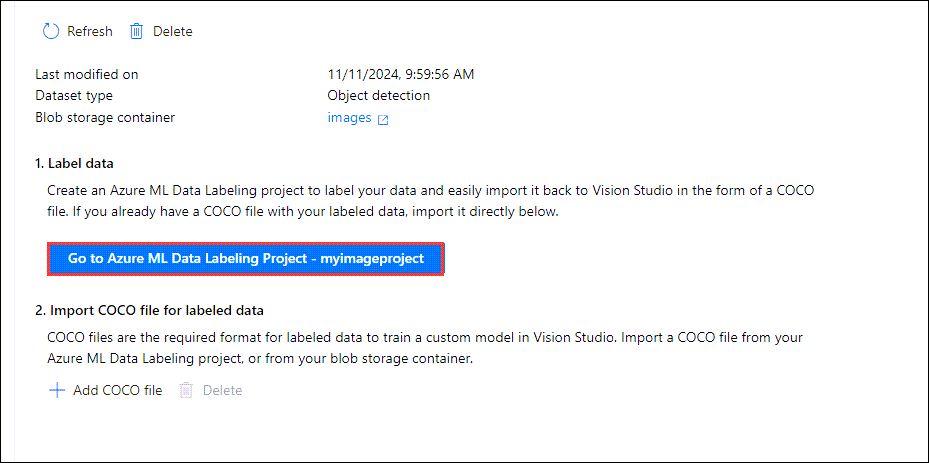
    
1. In the popup click on the dropdown and select **Import COCO file from an Azure ML Data Labeling project**

    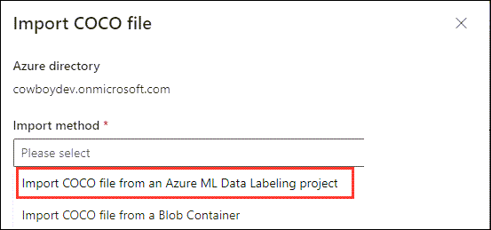
    
1. The popup will update. Provide a name and select your Subscription, Workspace, and Project. Then click the **Import and add COCO file**

    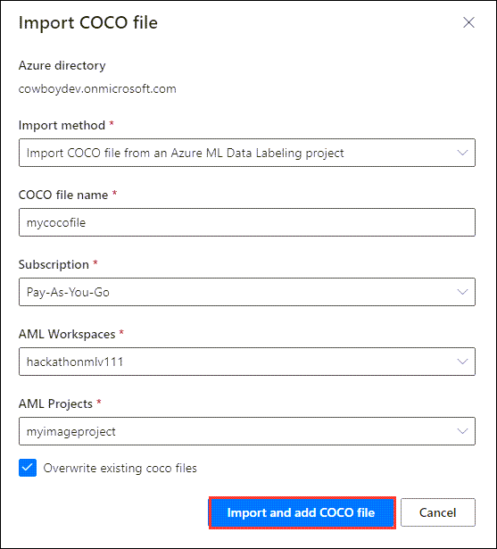
    
1. Next in the navigation click on **Custom models**

    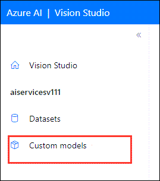
    
1. Click on **Train a new model**

    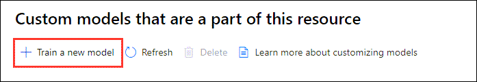
    
1. In the popup enter a unique name and select the **model type** as ***Object detection**. Then click **Next**

    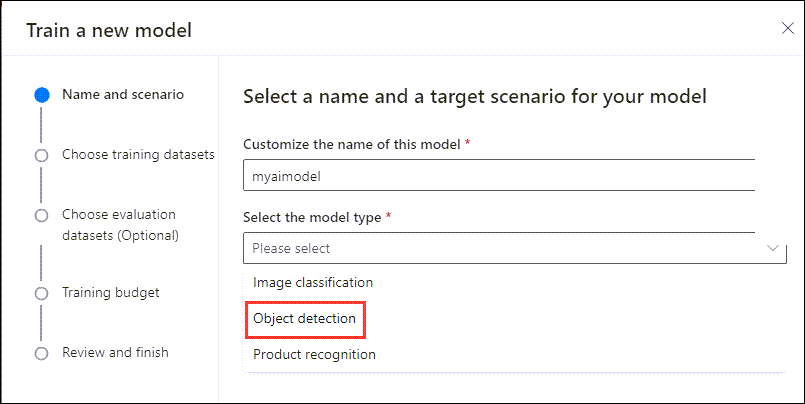
    
1. Select the dataset previously created and click **Next**

    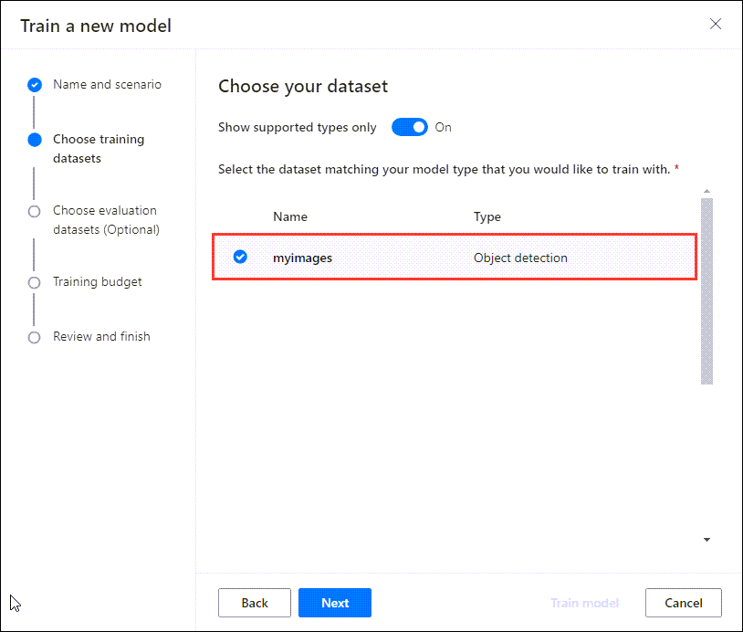
    
1. Select the same dataset for evaluation and click **Next**

    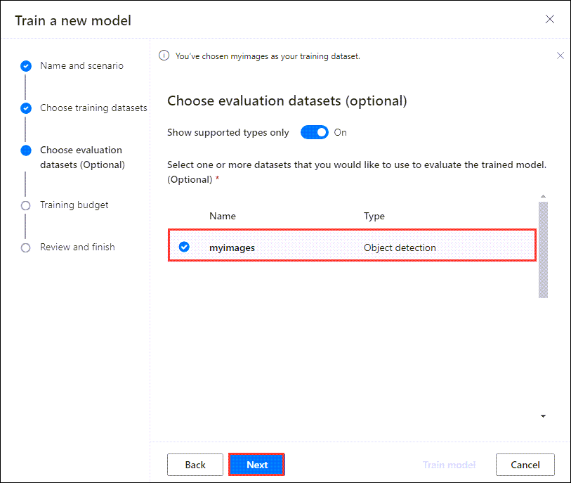
    
1. Leave the default value for training budget and click **Next**

1. Finally click **Train model**
    > Note: This will take a while to train (10-20 minutes)

1. Now that it has completed click on the name of the trained model

1. Click on the **Try it out** text

    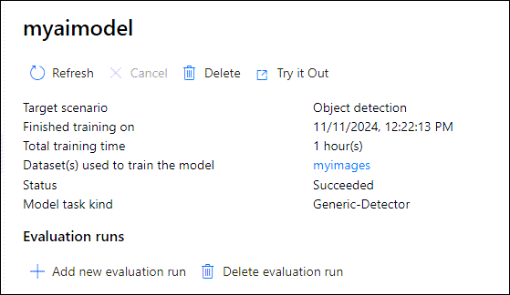
    
1. Click the checkbox the acknowledge to confirm usage fees

    
    
1. In the dropdown select the newly trained model

    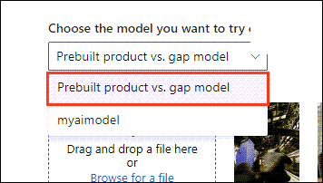
    
1. Then select individual files from the provided images and drag them in too validate. In this example I dragged a tshirt in and this is the result

    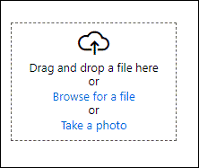


    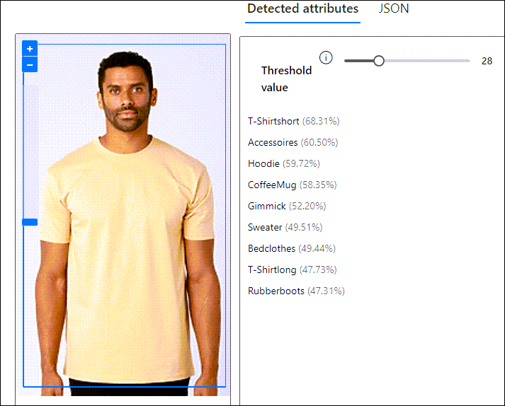


- https://learn.microsoft.com/en-us/azure/ai-services/computer-vision/how-to/model-customization?tabs=studio


