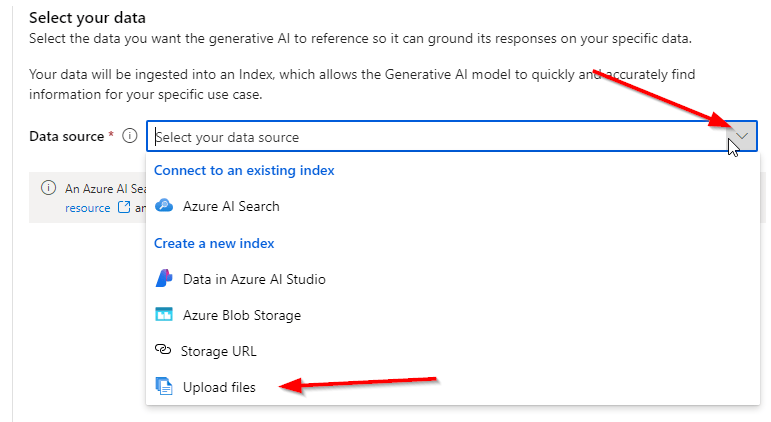
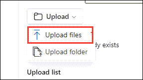
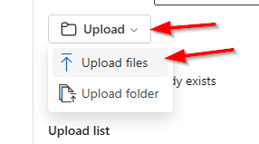
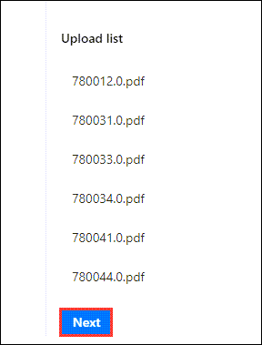
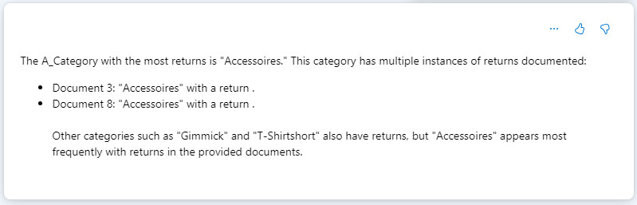
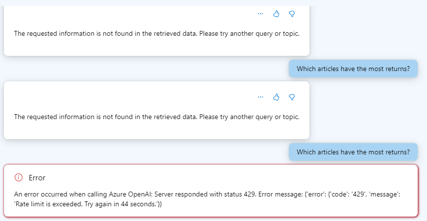

# Challenge 4 - Coaches Guide

## RAG Pattern

## Setup
1. Generate the pdf files from the data
1. Download the [sample Jupyter Notebook](https://openhackguides.blob.core.windows.net/ai-openhack/generate-markdown.ipynb) to generate the files needed.
1. If students are stuck getting the notebook functioning [here](https://openhackguides.blob.core.windows.net/ai-openhack/generatedpdfs.zip) is the generated pdf files
1. Starting in the new AI Studio https://ai.azure.com/
1. Create a new Hub and Project
1. Create two deployments
    - text-embedding-ada-002
    - gpt-4o
1. In Project Playground click on **Chat**
1. Click on the **Add your data** tab and then click *Add new data source**  
    
    
    
1. On the **Data source** dropdown choose **Upload files**

    

1. From the **Upload** button click the arrow and select **Upload files**

    
    
1. From the generated pdf files select 15 to upload

    
    
1. Click on the **Next** button

    
    
1. Create a new **Azure AI Search service**

    
    
1. Select a Basic service and click **Review + Create**

    
    
1. The click **Create 

1. After deployment return back to the **Azure AI Studi**o and from the dropdown select **Connect other Azure AI Search resource**

    
    
1. Click **Add connection**

    

1. Create a indentifiable **Index name** and click **Next**

    
    
1. Leave the default settings on the **Search settings** page. Click **Next**

    

1. Click **Create**

1. Give it some time to **Crack and chunk** the data

    

1. Once completed change the **Search** type to **Hybrid(vector + keyword)**

    
    
1. Expand the **Advanced settings** section and max out the following:

    
    
1. Use the following prompt

    ```
    Which A_Category has the most returns?
    ```
1. Results...

    
    
    > Note: There might be issues getting it to complete correctly with the following kinds of errors provided. Seems like repeating the prompt and selecting different **Search type(s)** works most of the time. Also refreshing the page and selecting the index resolves the issue too.

    

    > Another possible answer result
    
    

## Bonus
- Using the System message map the A_Category to the word Category to make the prompt easier to use.
