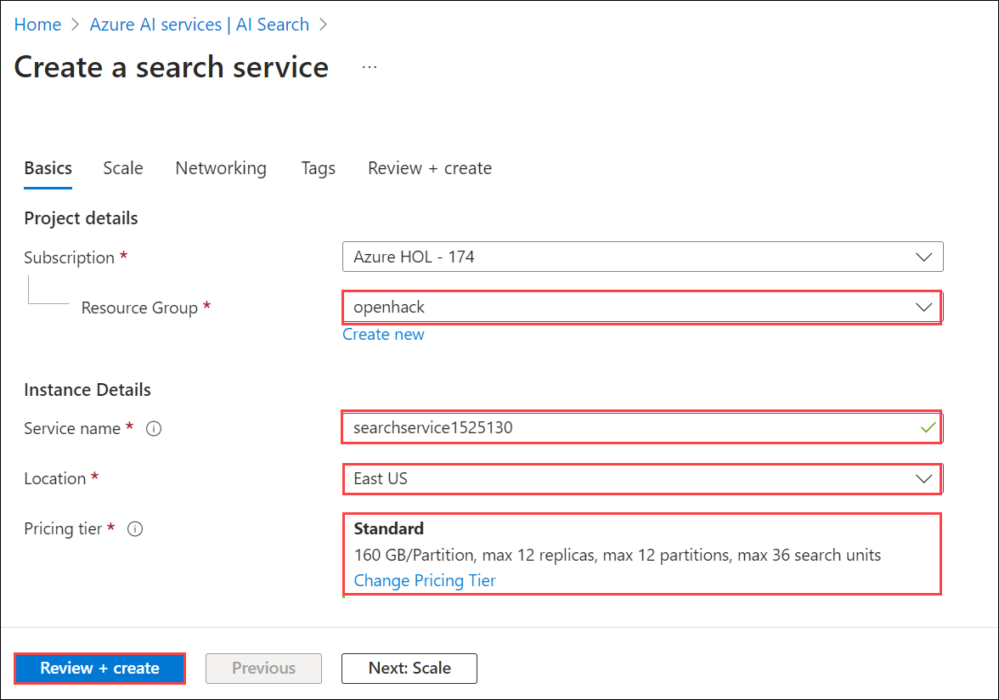

# Challenge 4 - Coaches Guide

## RAG Pattern

## Task - 01

1. Login to the Azure AI portal at `https://ai.azure.com/`.
   
2. Click on **create project** , Give an unique name to the project.

   

3. Under Create a project.
    - Project name : Unique name
    - Hub name : Provide an unique name.

   Then click on create
   

5. On the **Create a hub** pane , Provide the details as shown below:
   
    - Hub name : Leave as default
    - Subscription : Leave as default.
    - Resource Group : choose **OpenHack** from the drop down.
    - Location : Leave default.
    - Connect Azure AI services : Leave default.

    
    
7. Select create new AI search , A new browser page will open , log in using your credentials.
   
     - Resource Group : Openhack
     - Service name : Give a unique name.
     - Location : **East US**.
     - Pricing tier : Choose standard.
     - Click on **Review + Create** and proceed with the creation.
   
    
    
    

8. Under "My Assets," select **Models + Endpoints**, then click on **Deploy a Model** and choose **Deploy a Base Model**.
    
    

9. Choose gpt-4o and click on confirm.

    

10. Fill in the details as shown below:
    
    - Deployment name : Gpt-4o
    - Deployment type : Global Standard
    - Click on customize
    - Token's per Minute rate limit : 10k

     
     
11. Click on **Playground** and then select **Try the Chat Playground** .
     
    
   
1. Click on the **Add your data** tab and then click **Add new data source**  
    
    
    
1. On the **Data source** dropdown choose **Upload files**

    

1. From the **Upload** button click the arrow and select **Upload files**

    
    
1. Click on the **Next** button

    
    
1. After deployment return back to the **Azure AI Studio**and from the dropdown select **Connect other Azure AI Search resource**

    
    
1. Click **Add connection**

    

1. Create a indentifiable **Index name** and click **Next**

    
    
1. Leave the default settings on the **Search settings** page. Click **Next**

    

1. Click **Create vector index**

    

1. Give it some time to **Crack and chunk** the data

    

1. Once completed change the **Search** type to **Hybrid(vector + keyword)**

    
    
1. Expand the **Advanced settings** section and max out the following:

    
    
1. Use the following prompt

    ```
    Which A_Category has the most returns?
    ```
1. Results...

    
    
    > Note: There might be issues getting it to complete correctly with the following kinds of errors provided. Seems like repeating the prompt and selecting different **Search type(s)** works most of the time. Also refreshing the page and selecting the index resolves the issue too.

    

    > Another possible answer result
    
    

## Bonus
- Using the System message map the A_Category to the word Category to make the prompt easier to use.
