# Challenge 5 - Coaches Guide

## Capstone Project 

### Export a CSV File from SQL Server
1. From SQL Server export out a csv file from the following query. This gives you the top 30% of values. :
    ```
    WITH RankedData AS (
        SELECT 
            dbo.Orders._KEY_OrderNo, dbo.Orders._KEY_Supplier, dbo.Orders.ArticleNo, dbo.Article.A_Category AS Category, dbo.Supplier.S_Country as Country, dbo.Customer.KEY_CustomerNo, dbo.Customer.C_MeansOfPayment, dbo.Customer.C_Fit, 
                             dbo.Orders.F_IsDefect as IsDefect, dbo.Orders.F_IsReturned, dbo.Orders.F_Discounts, dbo.Orders.F_VolumeDiscount, dbo.Orders.F_StudentDiscount, dbo.Orders.F_ListPrice, dbo.Customer.C_City
    ,
            ROW_NUMBER() OVER (ORDER BY _KEY_ArticleNo DESC) AS row_num,  -- Ranking rows based on the 'sales' column
            COUNT(*) OVER() AS total_rows                          -- Total number of rows in the table
    
            FROM            dbo.Article INNER JOIN
                             dbo.Orders ON dbo.Article.ArticleNo = dbo.Orders.ArticleNo INNER JOIN
                             dbo.Customer ON dbo.Orders.CustomerNumber = dbo.Customer.CustomerNumber INNER JOIN
                             dbo.Supplier ON dbo.Orders.SupplierNumber = dbo.Supplier.SupplierNo
    )
    SELECT 
        *
    FROM 
        RankedData
    WHERE 
        row_num <= total_rows * 0.99;  -- Filtering for the top 30%
    ```

1. From the database use the context menu and select Export Data

    
    
1. For the **Choose a Data Source** screen set the following and click **Next**
    - Data source: SQL Native Client 11.0
    - Server name: Leave default value
    - Change to SQL Server Authentication
        - Put in username and password
    - Database: Leave default

    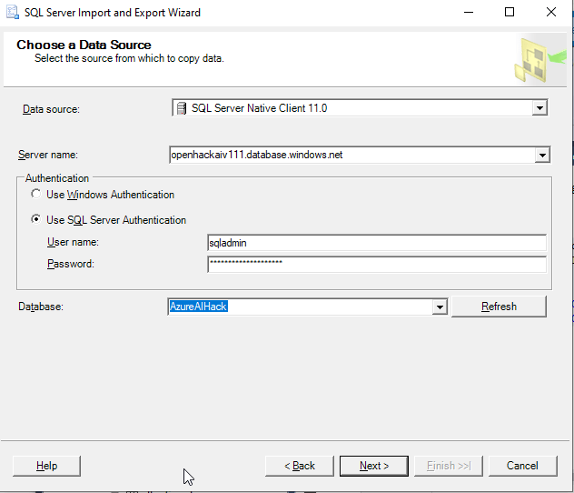
    
1. Set the Destination to **Flat File Destination**. Make sure you check **Unicode**

    
    
1. Select a folder to export the file out to. Make sure the type of csv is selected

    
    
1. Click **Next**

1. Change the radio button to **Write a query to specify the data to transfer** then click **Next**

    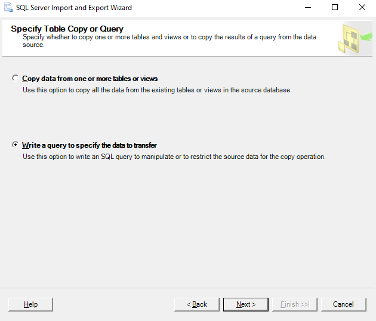
    
1. Copy in the query and click **Next**

    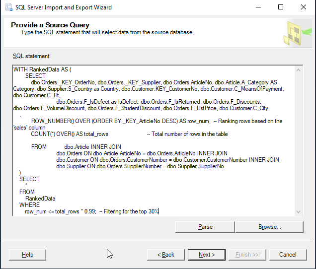
    
1. Then click **Next**, **Next**, and finally **Finish** to run the SSIS job.

### Setup a Vector Index

1. Return to AI Studio and open your previous project

1. Click on **Data** in the navigation and then click on the **New data** button

    
    
1. From the **Data source** dropdown select **Upload files/folders**

    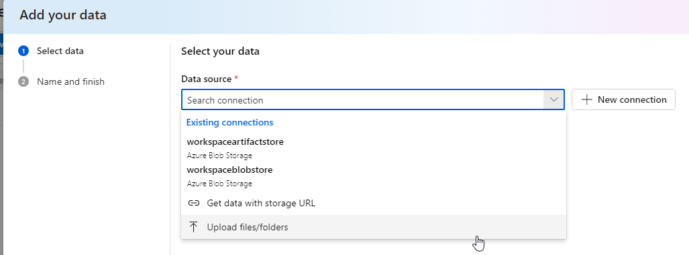
    
1. Select **Upload files** from the button

    
    
1. Select the exported csv file and then click **Next**

    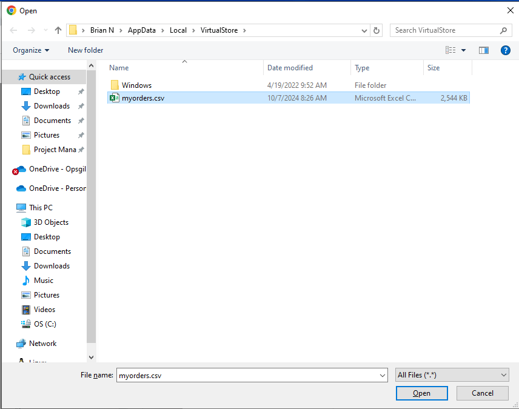
    
1. Provide a unique **Data name** then click **Create**

    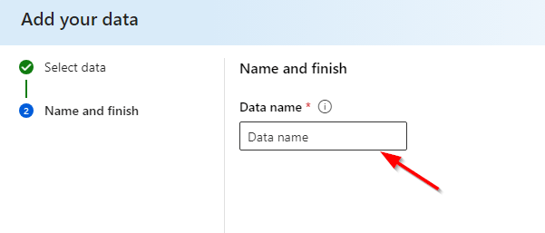
    
1. Next click on **Indexes** and click **+ New index**

    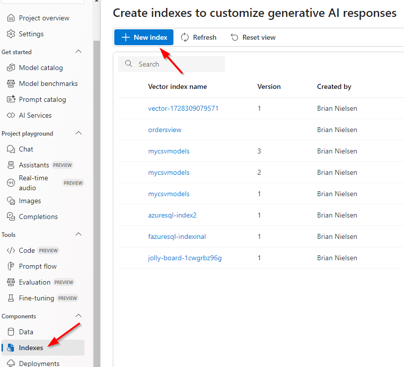
    
1. From the dropdown select **Data in Azure AI Studio**

    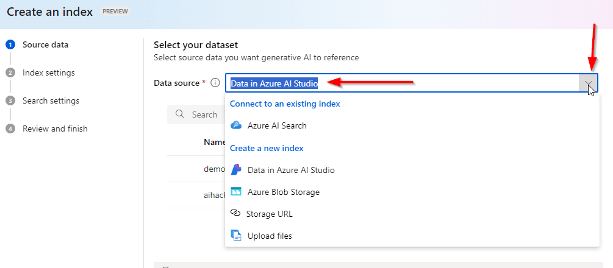
    
1. Click the radio button next to the **Data source** you created previously then click **Next**

    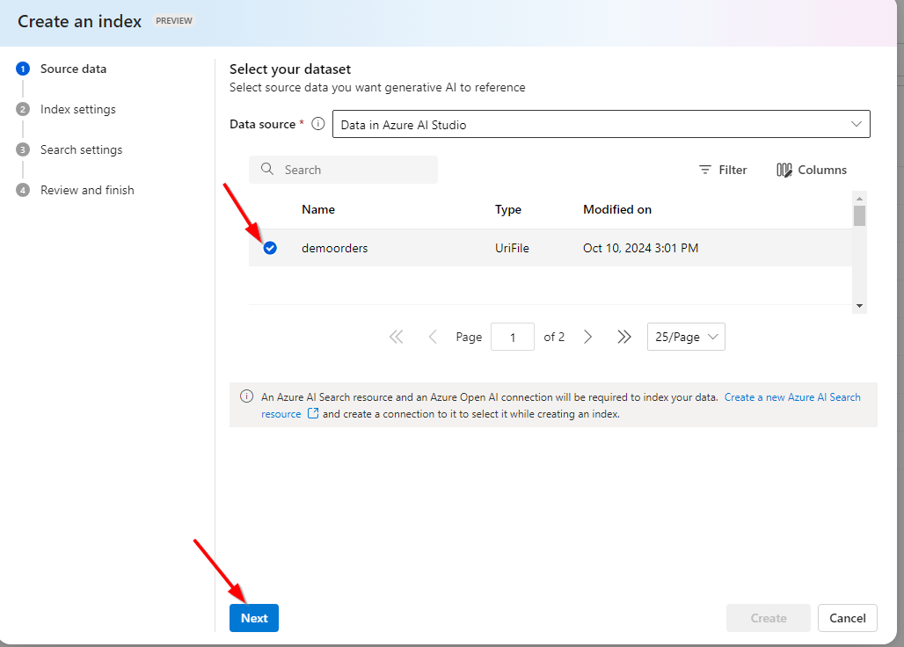
    
1. Configure the **Azure AI Search** by selecting your **AI Search** and using the current **Index name** then click **Next**

1. On the **Configure search settings** leave the default settings and then click **Next**

    
    
1. Click **Create**

1. Give the AI Studio time to complete the ingestion process

    
    
1. As it progresses

    
    
1. Completed

    
    
1. Then click the **Chat** link in the navigation. The click the Add your data tab

    

1. From the dropdown **Select available project index** select the index previously created

    

1. To get an idea of the what kind and when you might need certain inventory use the following prompt:
    ```
    based off the previous sales, what categories should be pre-ordered for each quarter?
    ```


    
    
1. Use a Azure AI Studio prompt to generate a sample inventory needed
    ```
    based off the current orders what would be a provisional inventory as a csv file?
    ```

    
    
1. Use the following sample csv file to import into the newly created **Cosmos DB**

    ```
    Item,Category,Quantity,Country
    T-Shirtshort,Clothing,6,Germany  
    T-Shirtshort,Clothing,15,USA  
    Accessoires,Accessories,7,France  
    CoffeeMug,Household,2,Germany  
    T-Shirtshort,Clothing,15,USA  
    T-Shirtshort,Clothing,15,USA  
    Gimmick,Toys,19,China  
    Accessoires,Accessories,20,China  
    CoffeeMug,Household,2,Germany  
    T-Shirtlong,Clothing,15,USA  
    Gimmick,Toys,19,China  
    T-Shirtshort,Clothing,16,USA  
    Hoodie,Clothing,16,USA  
    Accessoires,Accessories,6,France  
    Sweater,Clothing,10,France  
    CoffeeMug,Household,1,Germany  
    T-Shirtshort,Clothing,15,USA  
    Accessoires,Accessories,20,China  
    Accessoires,Accessories,3,Germany  
    Gimmick,Toys,19,China  
    T-Shirtlong,Clothing,15,USA  
    T-Shirtshort,Clothing,0,Germany  
    T-Shirtlong,Clothing,2,Germany  
    Accessoires,Accessories,20,China  
    Accessoires,Accessories,3,Germany  
    Hoodie,Clothing,6,USA  
    T-Shirtshort,Clothing,4,Germany  
    Gimmick,Toys,19,China  
    T-Shirtlong,Clothing,2,Germany  
    T-Shirtshort,Clothing,2,Germany  
    Accessoires,Accessories,7,France  
    Accessoires,Accessories,20,China  
    Accessoires,Accessories,6,France  
    Hoodie,Clothing,5,Germany  
    T-Shirtshort,Clothing,15,USA  
    Accessoires,Accessories,20,China  
    Gimmick,Toys,19,China  
    Accessoires,Accessories,7,France  
    CoffeeMug,Household,13,UK  
    Gimmick,Toys,19,China  
    ```    
    
<!-- ## Get the Prompt Flow available as a Web App
1. In the **Chat Playground** select **Prompt Flow**

    
1. Start the Compute Session

    

1. Click on **Deploy**, accept the default settings and click **Review + Create**

    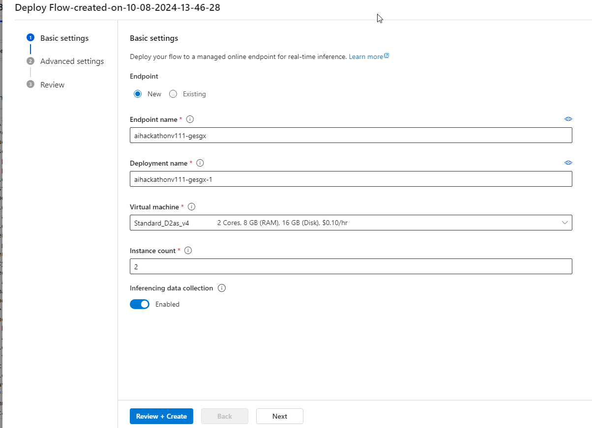
    
1. Then click **Create**

1. Click the **Deployments** link in the navigation. You will notice an endpoint in addition to the model deployments

    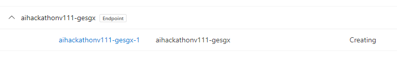


1. Populate the following fields then click **Deploy**. Take

    - Name
    - Subscription
    - Resource Group
    - Location
    - Pricing plan
    - Enable chat history = true

    

-->

### Add data to CosmosDB

<!--1. Create a Cosmos DB and select the **Azure Cosmos DB for NoSQL** option

    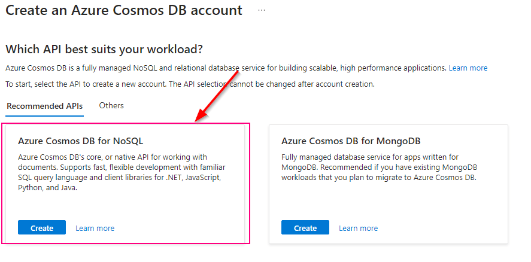
    
1. Provide a unique name and leave the default settings on the **Basics** tab

    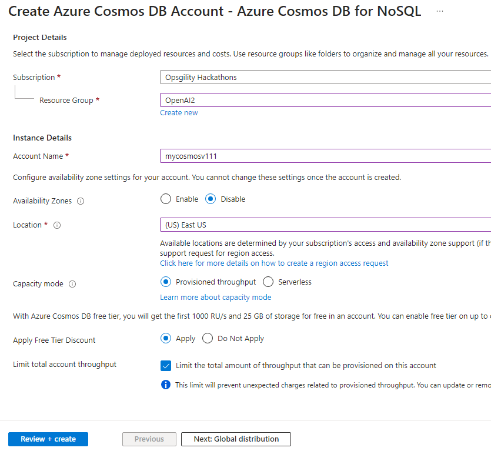
    
1.  On the **Backup Policy** tab make sure to select **Locally-redundant backup storage**

    
    
1. Finally create the Cosmos DB by clicking the **Create** button.-->

1. In the Azure portal open the pre-deployed Cosmos DB and click on **Data Explorer** and select ** + New Container**

    
    
1. Create a **Database id**, **Container id**, and also use **/category** as the **Partition key**. Then click **OK**

    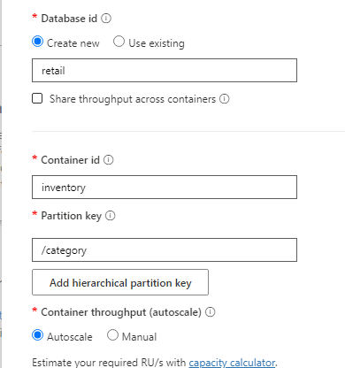
    

    
1. Get the following information for the Cosmos DB

    - URI
    - Primary Key
    - Database Name
    - Container Name
    
1. Run the following before running the sample script

    ```
    pip install azure-cosmos pandas
    
    ```

1. Run the following notebook file in a newly create Jupyter notebook file and folder.

    ```
    from azure.cosmos import CosmosClient, PartitionKey
    import pandas as pd
    import uuid  # To generate unique IDs
    
    # Cosmos DB configuration
    COSMOS_DB_URL = 'https://<URI>.documents.azure.com:443/'  # Example: https://your-account.documents.azure.com:443/
    COSMOS_DB_KEY = ''
    DATABASE_NAME = 'retail'
    CONTAINER_NAME = 'inventory'
    
    # Initialize the Cosmos client
    client = CosmosClient(COSMOS_DB_URL, COSMOS_DB_KEY)
    
    # Get the database and container reference
    database = client.get_database_client(DATABASE_NAME)
    container = database.get_container_client(CONTAINER_NAME)
    
    # Read the CSV file into a DataFrame
    csv_file_path = 'importtocosmos.csv'  # Example: './data.csv'
    data = pd.read_csv(csv_file_path)
    
    # Insert data from CSV into Cosmos DB with generated IDs
    for index, row in data.iterrows():
        # Convert the row to a dictionary
        item = row.to_dict()
    
        # Generate a unique id for each document
        item['id'] = str(uuid.uuid4())
    
        # Insert item into Cosmos DB
        container.create_item(body=item)
    
    
    print("Data inserted into Cosmos DB successfully.")
    ```

1. Here is a pre-built [Jupyter Notebook](https://openhackguides.blob.core.windows.net/ai-openhack/importtoCosmos.ipynb) of the script

### Setup Inventory Application
1. Create a new folder from the command line and initialize the application
    ```
    npm init -y
    ```
1. Install Dependencies
First, install the required dependencies using npm:

    ```
    npm install express @azure/cosmos tedious bootstrap
    ```
    - **express**: Web server framework.
    - **@azure/cosmos**: Cosmos DB client.
    - **tedious**: SQL Server (Azure SQL) client for Node.js.
    - **bootstrap**: Frontend styling framework.
    

    
1. You'll need to configure the connection for the Azure SQL Database. Here’s a basic setup using the tedious package. Create a file called dbconfig.js for the SQL configuration:

    ```
    const { Connection, Request } = require('tedious');
    
    const config = {
        server: '<URI>.database.windows.net', // Update
        authentication: {
            type: 'default',
            options: {
                userName: '', // Update
                password: '', // Update
            },
        },
        options: {
            database: 'AzureAIHack', // Update
            encrypt: true,
        },
    };
    
    function executeSQLQuery(query, callback) {
        const connection = new Connection(config);
    
        connection.on('connect', (err) => {
            if (err) {
                console.error('Connection failed:', err);
                callback(err, null);
            } else {
                console.log('Connected to SQL Server');
                const result = [];
    
                const request = new Request(query, (err) => {
                    if (err) {
                        console.error('Query execution failed:', err);
                        callback(err, null);
                    }
                });
    
                // 'row' event is triggered for each row in the result set
                request.on('row', columns => {
                    const rowObject = {};
                    columns.forEach(column => {
                        rowObject[column.metadata.colName] = column.value;
                    });
                    result.push(rowObject);  // Push each processed row into the result array
                });
    
                // 'requestCompleted' event is triggered after all rows are processed
                request.on('requestCompleted', () => {
                    console.log('Request completed');
                    console.log(`${result.length} rows returned`);
                    callback(null, result);  // Return the final result
                    connection.close();  // Close the connection after query execution
                });
    
                connection.execSql(request);
            }
        });
    
        connection.connect();
    }
    
    module.exports = { executeSQLQuery };

    
    ```
    


1. Here is the main app.js file with three routes and lazy loading using Bootstrap tabs:

    ```
    const express = require('express');
    const { CosmosClient } = require('@azure/cosmos');
    const { executeSQLQuery } = require('./dbconfig');  // SQL connection
    const path = require('path');
    
    // Cosmos DB configuration
    const COSMOS_DB_URL = 'https://<URI>.documents.azure.com:443/'; // Example:https://your-account.documents.azure.com:443/
    const COSMOS_DB_KEY = '==';
    const DATABASE_NAME = 'retail';
    const CONTAINER_NAME = 'inventory';
    
    // Initialize Cosmos Client
    const client = new CosmosClient({ endpoint: COSMOS_DB_URL, key: COSMOS_DB_KEY });
    const database = client.database(DATABASE_NAME);
    const container = database.container(CONTAINER_NAME);
    
    const app = express();
    app.use(express.static(path.join(__dirname, 'public')));
    
    // Route 1: Serve Cosmos DB data as JSON
    app.get('/cosmos', async (req, res) => {
        try {
            const querySpec = { query: 'SELECT * FROM c' };
            const { resources: items } = await container.items.query(querySpec).fetchAll();
            res.json(items);  // Return Cosmos DB data as JSON
        } catch (err) {
            res.status(500).send('Error fetching data from Cosmos DB: ' + err.message);
        }
    });
    
    // Route 2: Serve SQL data as JSON
    app.get('/sql', (req, res) => {
        // Query to select the top 15 rows from Orders, Article, Customer, and Supplier tables
        const query = `SELECT TOP 15 
          dbo.Article.A_Category AS Category,
          dbo.Supplier.S_Country AS Country,
          dbo.Orders.F_IsDefect AS IsDefect
        FROM dbo.Article 
        INNER JOIN dbo.Orders ON dbo.Article.ArticleNo = dbo.Orders.ArticleNo
        INNER JOIN dbo.Customer ON dbo.Orders.CustomerNumber = dbo.Customer.CustomerNumber
        INNER JOIN dbo.Supplier ON dbo.Orders.SupplierNumber = dbo.Supplier.SupplierNo`;  // Replace with your actual SQL query
    
        executeSQLQuery(query, (err, result) => {
            if (err) {
                console.error('SQL Error:', err.message);  // Log error to console
                res.status(500).send('Error fetching data from SQL: ' + err.message);
            } else {
                console.log('SQL Result:', result);  // Log result to console for debugging
                res.json(result);  // Return SQL data as JSON
            }
        });
    });
    
    // Route 3: User-configurable iframe
    app.get('/iframe', (req, res) => {
        const url = req.query.url || 'https://example.com';  // Default URL
        res.send(`
        <html>
          <head>
            <title>Iframe Page</title>
            <style>iframe { width: 100%; height: 90vh; }</style>
          </head>
          <body>
            <h1>Embedded Website</h1>
            <iframe src="${url}" frameborder="0"></iframe>
          </body>
        </html>
      `);
    });
    
    // Start the server
    const port = 3000;
    app.listen(port, () => {
        console.log(`App running on http://localhost:${port}`);
    });
    ```
1. In the above code, replace the following placeholders with your actual Cosmos DB configuration:

    - your-cosmosdb-url
    - your-cosmosdb-primary-key
    - your-database-name
    - your-container-name

1. In the public directory, create an index.html file with the Bootstrap tab navigation and lazy loading functionality.

    ```
    <!DOCTYPE html>
    <html lang="en">
    
    <head>
        <meta charset="UTF-8">
        <meta name="viewport" content="width=device-width, initial-scale=1.0">
        <title>Node.js App with Tabs</title>
        <link rel="stylesheet" href="https://stackpath.bootstrapcdn.com/bootstrap/4.5.2/css/bootstrap.min.css">
    </head>
    
    <body>
    
        <div class="container mt-4">
            <h1>Data Display Application</h1>
            <ul class="nav nav-tabs" id="dataTabs" role="tablist">
                <li class="nav-item">
                    <a class="nav-link active" id="cosmos-tab" data-toggle="tab" href="#cosmos" role="tab">Cosmos DB
                        Data</a>
                </li>
                <li class="nav-item">
                    <a class="nav-link" id="sql-tab" data-toggle="tab" href="#sql" role="tab">SQL Data</a>
                </li>
                <li class="nav-item">
                    <a class="nav-link" id="iframe-tab" data-toggle="tab" href="#iframe" role="tab">Iframe</a>
                </li>
            </ul>
    
            <div class="tab-content" id="dataTabsContent">
                <!-- Cosmos DB Data Tab -->
                <div class="tab-pane fade show active" id="cosmos" role="tabpanel">
                    <h2>Cosmos DB Data</h2>
                    <table class="table table-striped">
                        <thead>
                            <tr>
                                <th>Item</th>
                                <th>Category</th>
                                <th>Quantity</th>
                                <th>Country</th>
                            </tr>
                        </thead>
                        <tbody id="cosmos-data">
                        </tbody>
                    </table>
                </div>
    
                <!-- SQL Data Tab -->
                <div class="tab-pane fade" id="sql" role="tabpanel">
                    <h2>SQL Server Data</h2>
                    <!-- Row count div -->
                    <div id="row-count" class="mb-3"></div> <!-- Ensure this element exists -->
                    <table class="table table-striped">
                        <thead>
                            <tr>
                                <th>Category</th>
                                <th>Country</th>
                                <th>Is Defect</th>
                            </tr>
                        </thead>
                        <tbody id="sql-data">
                        </tbody>
                    </table>
                </div>
    
                <!-- Iframe Tab -->
                <div class="tab-pane fade" id="iframe" role="tabpanel">
                    <h2>Embedded Website</h2>
                    <form id="iframe-form">
                        <div class="form-group">
                            <label for="iframe-url">Enter URL:</label>
                            <input type="text" class="form-control" id="iframe-url" placeholder="https://example.com">
                        </div>
                        <button type="submit" class="btn btn-primary">Load Website</button>
                    </form>
                    <iframe id="iframe-content" width="100%" height="600px"></iframe>
                </div>
            </div>
        </div>
    
        <script src="https://code.jquery.com/jquery-3.5.1.min.js"></script>
        <script src="https://cdn.jsdelivr.net/npm/bootstrap@4.5.2/dist/js/bootstrap.bundle.min.js"></script>
    
        <script>
            // Helper function to trim object keys
            function trimKeys(obj) {
                return Object.keys(obj).reduce((acc, key) => {
                    acc[key.trim()] = obj[key];
                    return acc;
                }, {});
            }
    
            // Lazy load Cosmos DB data
            $('#cosmos-tab').on('shown.bs.tab', function () {
                fetch('/cosmos')
                    .then(response => response.json())
                    .then(data => {
                        const tbody = document.getElementById('cosmos-data');
                        tbody.innerHTML = '';
                        data.forEach(item => {
                            // Trim the keys before rendering
                            const normalizedItem = trimKeys(item);
                            const row = `<tr>
                            <td>${normalizedItem.Item || ''}</td>
                            <td>${normalizedItem.category || ''}</td>
                            <td>${normalizedItem.Quantity || ''}</td>
                            <td>${normalizedItem.Country || ''}</td>
                          </tr>`;
                            tbody.innerHTML += row;
                        });
                    })
                    .catch(err => console.error('Error fetching Cosmos DB data:', err));
            });
    
            // Lazy load SQL Server data
            $('#sql-tab').on('shown.bs.tab', function () {
                fetch('/sql')
                    .then(response => response.json())
                    .then(data => {
                        const tbody = document.getElementById('sql-data');
                        tbody.innerHTML = '';  // Clear the table content
    
                        // Display the row count
                        const rowCount = data.length;
                        const rowCountDiv = document.getElementById('row-count');
                        //rowCountDiv.innerHTML = `Rows returned: ${rowCount}`;
    
                        // Append each row to the table
                        data.forEach(item => {
                            const row = `<tr>
                            <td>${item.Category || ''}</td>
                            <td>${item.Country || ''}</td>
                            <td>${item.IsDefect || ''}</td>
                          </tr>`;
                            tbody.innerHTML += row;
                        });
                    })
                    .catch(err => console.error('Error fetching SQL data:', err));
            });
    
            // Iframe form submission
            document.getElementById('iframe-form').addEventListener('submit', function (e) {
                e.preventDefault();
                const iframeUrl = document.getElementById('iframe-url').value;
                document.getElementById('iframe-content').src = iframeUrl;
            });
        </script>
    
    </body>
    
    </html>
    ```
1. Ensure your project structure looks like this:

    ```
    your-project-folder/
    │
    ├── dbconfig.js        # SQL Server connection and query execution file
    ├── app.js             # Main Node.js app
    ├── public/
    │   └── index.html     # Frontend HTML file
    ├── package.json       # npm package file
    ├── package-lock.json  # npm lock file
    └── node_modules/      # (generated after npm install)
    ```
    
1. To run the application, use the following command:

    ```
    node app.js
    ```
    
1. Once the app is running, open a web browser and go to [http://localhost:3000](http://localhost:3000). You should see the data from Cosmos DB displayed in an HTML list format.

    
    
1. The second tab will provide the first 15 rows of data from SQL Server

    
