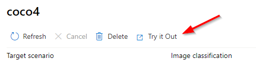
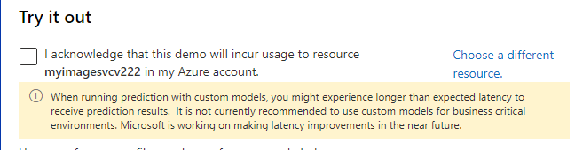
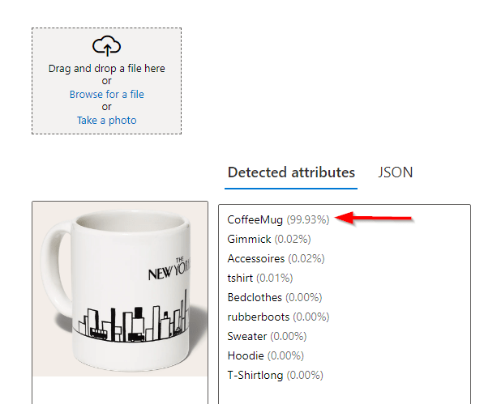

# Coaches Guide

## Challenge #1  - SQL Server

1. Once the database has been deployed it is important for the Teams to try and figure out what is causing the returns from the underlying data. The easiest place to start is from the provided Views. 

1. This is the Select statement from **MainOrderSample**

    ```
    SELECT   top 15     dbo.Orders._KEY_OrderNo, dbo.Orders._KEY_Supplier, dbo.Orders.ArticleNo, dbo.Article.A_Category, dbo.Supplier.S_Country, dbo.Customer.KEY_CustomerNo, dbo.Customer.C_MeansOfPayment, dbo.Customer.C_Fit, 
                             dbo.Orders.F_IsDefect, dbo.Orders.F_IsReturned, dbo.Orders.F_Discounts, dbo.Orders.F_VolumeDiscount, dbo.Orders.F_StudentDiscount, dbo.Orders.F_ListPrice, dbo.Customer.C_City
    FROM            dbo.Article INNER JOIN
                             dbo.Orders ON dbo.Article.ArticleNo = dbo.Orders.ArticleNo INNER JOIN
                             dbo.Customer ON dbo.Orders.CustomerNumber = dbo.Customer.CustomerNumber INNER JOIN
                             dbo.Supplier ON dbo.Orders.SupplierNumber = dbo.Supplier.SupplierNo
    ```
    
1. Starting from that sample query its possible to modify it to get just the important columns and also the pertinent data with the following query:

    ```
    SELECT   COUNT(dbo.Orders.F_IsReturned),   dbo.Article.A_Category
    FROM            dbo.Article INNER JOIN
                             dbo.Orders ON dbo.Article.ArticleNo = dbo.Orders.ArticleNo INNER JOIN
                             dbo.Customer ON dbo.Orders.CustomerNumber = dbo.Customer.CustomerNumber INNER JOIN
                             dbo.Supplier ON dbo.Orders.SupplierNumber = dbo.Supplier.SupplierNo
    						 WHERE dbo.Orders.F_IsReturned = 1
    						 GROUP BY dbo.Article.A_Category
    						 ORDER BY COUNT(dbo.Orders.F_IsReturned) DESC
    ```
    
1. This query will provide the following result and shows that the top 2 Categories that have issues are **Accessoires** and **T-Shirtshort** .

    

- [Challenge-1 Coaches Guide](Challenge-1.md)

## Challenge #2 - Machine Learning

1. Once the deployment is complete you can use the following to validate the results in a **Notebook**

1. Paste in the following sample json in the data section of the python code. 

    > Note this is just testing that it is functional
    ```
    {
    	"Inputs": {
    		"input1": [
    			{
    				"_KEY_OrderNo": 1028476,
    				"_KEY_Supplier": 16,
    				"ArticleNo": 502,
    				"KEY_CustomerNo": 10752,
    				"F_Discounts": 0,
    				"F_VolumeDiscount": 0,
    				"F_StudentDiscount": 0,
    				"F_ListPrice": 33.99,
    				"F_IsReturned": 0,
    				"A_Category": "T-Shirt short",
    				"S_Country": "USA",
    				"C_MeansOfPayment": "direct debit",
    				"C_Fit": "Regular",
    				"F_IsDefect": 0,
    				"C_City": "Berlin"
    			}
    		]
    	},
    	"GlobalParameters": {}
    }
    ```
1. Execute the cell
1. View the results at the bottom

    
    
1. This sample json will provide a positive detection of a return

    ```
    {
    	"Inputs": {
    		"input1": [
    			{
    				"_KEY_OrderNo": 477063,
    				"_KEY_Supplier": 35,
    				"ArticleNo": 568702,
    				"KEY_CustomerNo": 805629,
    				"F_Discounts": 1,
    				"F_VolumeDiscount": 1,
    				"F_StudentDiscount": 1,
    				"F_ListPrice": 1886.79,
    				"F_IsReturned": 0,
    				"A_Category": "Accessoires",
    				"S_Country": "France",
    				"C_MeansOfPayment": "voucher",
    				"C_Fit": "Fide",
    				"F_IsDefect": 1,
    				"C_City": "Regensburg"
    			}
    		]
    	},
    	"GlobalParameters": {}
    }
    ```
    
- [Challenge-2 Coaches Guide](Challenge-2.md)


## Challenge #3 - Image Search

1. After training the images return to the Vision Portal https://portal.vision.cognitive.azure.com/gallery/featured

1. Select the recent resource that was worked on

    

1. Select **Custom models** in the navigation and select the **Coco** model previously created

    
    
1. Click on **Try it Out** to open a new tab

    
    
1. Accept the acknowledgement

    
    
1. From the dropdown select the trained model

    
    
1. Test a handful of images to validate that the correct Category is detected

    

- [Challenge-3 Coaches Guide](Challenge-3.md)

## Challenge #4 - RAG Pattern

1. Once completed change the **Search** type to **Hybrid(vector + keyword)**

    
    
1. Expand the **Advanced settings** section and max out the following:

    
    
1. Use the following prompt

    ```
    Which A_Category has the most returns?
    ```
1. Results...

    
    
    > Note: There might be issues getting it to complete correctly with the following kinds of errors provided. Seems like repeating the prompt and selecting different **Search type(s)** works most of the time. Also refreshing the page and selecting the index resolves the issue too.

    

    > Another possible answer result
    
    


- [Challenge-4 Coaches Guide](Challenge-4.md)

## Challenge #5 - Capstone project

1. Export a CSV File from SQL Server
1. Setup a Vector Index
1. Setup CosmosDB
1. Setup Inventory Application

- [Challenge-5 Coaches Guide](Challenge-5.md)
