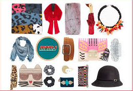
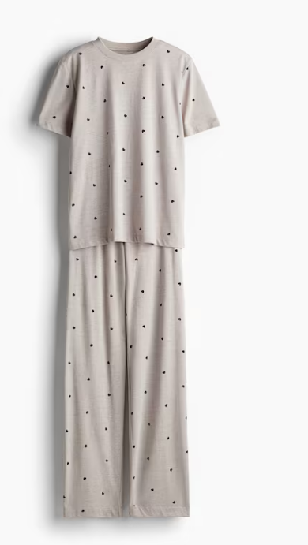
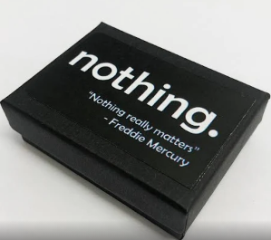
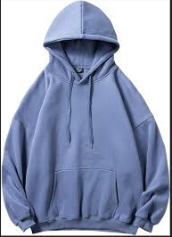
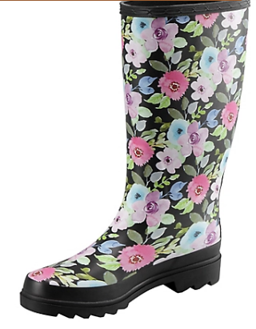
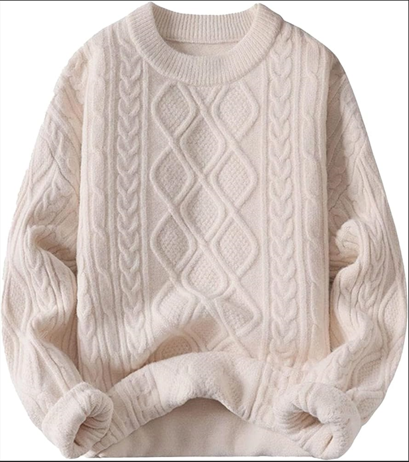
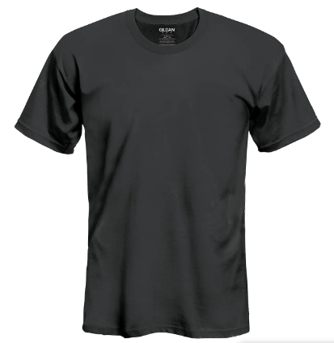

# Challenge 3 - Search Based on Images

## Background story

Now that you have a database to find the potential issues facing the Woodgrove Retail the next step is to build a AI service to add additional functionality. The goal of the feature should be to allow for searching and finding products available by uploading a picture a potential customer finds to see if this item is potentially available.

## Technical details

Using Vision Studio and Azure Machine Learning you will be tagging a few dozen images to build out an service to potentially re-purpose on the website.  
There are the [images](https://openhackguides.blob.core.windows.net/ai-openhack/images.zip) to start with.

| Product | Related image sample |
|---------|----------------------|
|Accessoires| |
|Bedclothes||
|Coffee Mug||
|Gimmick||
|Hoodie||
|Rubber boots||
|Sweater||
|T-Shirt long||
|tshirt||

## Success Criteria

- Once the model is trained you should click on the **Try it out** link and upload some of the sample images and validate that it results in an appropriate response.

## Resources
- [Create a custom Image Analysis model](https://learn.microsoft.com/en-us/azure/ai-services/computer-vision/how-to/model-customization?tabs=studio)
