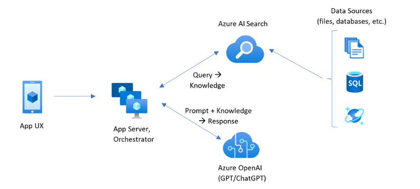

# Challenge 4 - RAG Pattern

## Background story
To enhance the results of the products available to customers Woodgrove Retail wants to utilize Azure OpenAI. This challenge will utilize the [RAG Pattern](https://learn.microsoft.com/en-us/azure/search/retrieval-augmented-generation-overview) as part of the solution. 

 

## Technical details

The team needs to utilize the provided Jupyter Notebook that will take the existing SQL table, provided View, and images provided to generate pdf files that will be uploaded to Azure Blob storage. Then using the Cognitive skills extract enhanced data from the documents to include at least the following:
* Article Number
* Category
* Content
* Color
* The related image 

### Steps required

1. Generate the pdf files from the data
1. Download the [sample Jupyter Notebook](https://openhackguides.blob.core.windows.net/ai-openhack/generate-markdown.ipynb) to generate the files needed.
1. Here is a sample of the [markdown output ](https://openhackguides.blob.core.windows.net/ai-openhack/780012.0.md)
1. Here is a sample of the [generated pdf](https://openhackguides.blob.core.windows.net/ai-openhack/780012.0.pdf)

## Success Criteria
Demonstrate to the coach of a working Search experience using the generated documents that uses Cognitive skills to provide a better search experience to find out what Categories were provided to which locations.

## Resources

- https://learn.microsoft.com/en-us/azure/ai-studio/concepts/retrieval-augmented-generation
- https://learn.microsoft.com/en-us/azure/ai-studio/how-to/data-add
- https://learn.microsoft.com/en-us/azure/ai-studio/how-to/index-add
- [How to add and manage data in your Azure AI Studio project](https://learn.microsoft.com/en-us/azure/ai-studio/how-to/data-add)
- [How to build and consume vector indexes in Azure AI Studio](https://learn.microsoft.com/en-us/azure/ai-studio/how-to/index-add)
